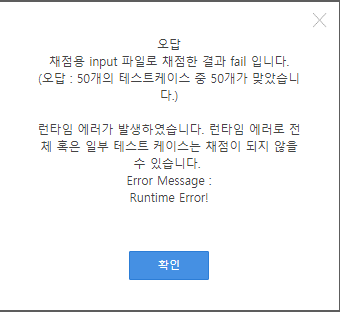

<!--more-->

## 7699. [염라대왕의 이름 정렬](https://swexpertacademy.com/main/code/problem/problemDetail.do?contestProbId=AWqU0zh6rssDFARG)


총 7번 제출했던 문제다.....

### 1. 답은 다 맞는데 런타임 에러 난 경우

> TreeSet<String> nameSet[] = new TreeSet[50]

라고 하면 이클립스에서   

`Type safety: The expression of type TreeSet[] needs unchecked conversion to conform to TreeSet<String>[]`  라는 경고를 준다.   
그래도 답이 나왔기 때문에 무시하고 제출했더니 답은 맞았는데 런타임 에러가 났다.    


검색해보니 배열이 아닌 List로 해야한다는 해답을 얻었다.    


<details>
<summary>코드 보기</summary>
<div markdown="1">

```java
import java.io.BufferedReader;
import java.io.InputStreamReader;
import java.util.TreeSet;

public class Solution {
	static int T, N;
	static TreeSet<String> nameSet[] = new TreeSet[50];

	static String s;

	public static void main(String[] args) throws Exception {
		BufferedReader in = new BufferedReader(new InputStreamReader(System.in));

		T = Integer.parseInt(in.readLine().trim());
		for (int test_case = 1; test_case <= T; test_case++) {
			N = Integer.parseInt(in.readLine().trim());


			for(int i=0; i<50; i++) {
				nameSet[i] = new TreeSet<>();
			}

			for(int i=0; i<N; i++) {
				s = in.readLine();
				nameSet[s.length()].add(s);
			}

			System.out.println("#"+test_case);

			for(int i=0; i<50; i++) {
				for(String s : nameSet[i]) {
					System.out.println(s);
				}
			}
		}
	}
}

```

</div>
</details>

### 2. 4초라니,,,,,,, 8ㅅ8

자신있게 ArrayList로 바꿔서 제출해서 Pass가 뜬 걸 보고 굉장히 뿌듯해했다 ^0^     
그런데 시간이 4초나 나오는 거시여따....왜?

<details>
<summary>코드 보기</summary>
<div markdown="1">

```java
import java.io.BufferedReader;
import java.io.InputStreamReader;
import java.util.ArrayList;
import java.util.List;
import java.util.TreeSet;

public class Solution  {
	static int T, N;
	static List<TreeSet<String>> nameSet;

	static String s;

	public static void main(String[] args) throws Exception {
		BufferedReader in = new BufferedReader(new InputStreamReader(System.in));

		T = Integer.parseInt(in.readLine().trim());
		for (int test_case = 1; test_case <= T; test_case++) {
			N = Integer.parseInt(in.readLine().trim());

			nameSet = new ArrayList<TreeSet<String>>();

			for(int i=0; i<50; i++) {
				nameSet.add(new TreeSet<String>());
			}
			for(int i=0; i<N; i++) {
				s = in.readLine();
				nameSet.get(s.length()-1).add(s);
			}

			System.out.println("#"+test_case);

			for(int i=0; i<50; i++) {
				for(String s : nameSet.get(i)) {
					System.out.println(s);
				}
			}
		}
	}
}

```

</div>
</details>

### 3. 분류를 해야겠다!

무식하게 List를 50개로 만들어 버린게 문제라고 생각이 되었다.      
그래서 입력받을때 String의 길이를 key로 받아서 Map에 넣기로 했다.      
역시나 Pass였고 역시나 뿌듯했다 ^0^      
그런데 또 4초...... 사딸라.... 8ㅅ8       

<details>
<summary>코드 보기</summary>
<div markdown="1">

```java
import java.io.BufferedReader;
import java.io.InputStreamReader;
import java.util.ArrayList;
import java.util.TreeMap;
import java.util.TreeSet;

public class Solution  {
	static int T, N;
	static TreeMap<Integer, TreeSet<String>> nameSet;
	static boolean check[];

	static String s;

	public static void main(String[] args) throws Exception {
		BufferedReader in = new BufferedReader(new InputStreamReader(System.in));

		T = Integer.parseInt(in.readLine().trim());
		for (int test_case = 1; test_case <= T; test_case++) {
			N = Integer.parseInt(in.readLine().trim());

			nameSet = new TreeMap<>();
			check = new boolean[51];

			for(int i=0; i<N; i++) {
				s = in.readLine();
				if(!nameSet.containsKey(s.length())) {
					nameSet.put(s.length(), new TreeSet<>());
				}
				nameSet.get(s.length()).add(s);
			}

			System.out.println("#"+test_case);

			for(int l : nameSet.keySet()) {
				for(String s : nameSet.get(l)) {
					System.out.println(s);
				}
			}
		}
	}
}


```

</div>
</details>


### 4. Comparator를 이용해보자!

아니 대체 뭐가 문제일까?      
TreeSet을 사용하는 것이 별로 이득이 되지 않는것인가?          
그렇담 List를 Sort 해보자!       
TreeSet이 정렬해주는 것보다 HashSet에 마구담고 List로 바꿔서 정렬하는게 더 나을거라는 멍청한 생각을 해버렸다.      
역시 4초.         

<details>
<summary>코드 보기</summary>
<div markdown="1">

```java
import java.io.BufferedReader;
import java.io.InputStreamReader;
import java.util.Arrays;
import java.util.Comparator;
import java.util.HashSet;

public class Solution  {
	static int T, N;
	static HashSet<String> nameSet;
	static String[] nameList;

	static String s;

	public static void main(String[] args) throws Exception {
		BufferedReader in = new BufferedReader(new InputStreamReader(System.in));

		T = Integer.parseInt(in.readLine().trim());
		for (int test_case = 1; test_case <= T; test_case++) {
			N = Integer.parseInt(in.readLine().trim());

			nameSet = new HashSet<>();

			for(int i=0; i<N; i++) {
				nameSet.add(in.readLine());
			}

			nameList = Arrays.copyOf(nameSet.toArray(), nameSet.size(), String[].class);

			Arrays.sort(nameList, new Comparator<String>() {

				@Override
				public int compare(String s1, String s2) {
					if(s1.length() == s2.length()) {
						return s1.compareTo(s2);
					}
					return s1.length() - s2.length();
				}
			});

			System.out.println("#"+test_case);

			for(String s: nameList) {
				System.out.println(s);
			}
		}
	}
}

```

</div>
</details>


### 5. TreeSet의 Comparator를 이용하면 되잖아!

Pass를 받고 또초를 보고 바로 바보였다는 생각을 했다..     
TreeSet이나 HashSet을 정렬하는거나 다를게 없잖아      
오히려 List로 변경하는 일을 한번 더 하는 멍청한 짓이었다       
그래서 TreeSet의 Comparator를 이용해서 정렬하였다.          
와우;; 3.9초 ㅎ;;       

<details>
<summary>코드 보기</summary>
<div markdown="1">

```java
import java.io.BufferedReader;
import java.io.InputStreamReader;
import java.util.Arrays;
import java.util.Comparator;
import java.util.HashSet;

public class Solution  {
	static int T, N;
	static HashSet<String> nameSet;
	static String[] nameList;

	static String s;

	public static void main(String[] args) throws Exception {
		BufferedReader in = new BufferedReader(new InputStreamReader(System.in));

		T = Integer.parseInt(in.readLine().trim());
		for (int test_case = 1; test_case <= T; test_case++) {
			N = Integer.parseInt(in.readLine().trim());

			nameSet = new HashSet<>();

			for(int i=0; i<N; i++) {
				nameSet.add(in.readLine());
			}

			nameList = Arrays.copyOf(nameSet.toArray(), nameSet.size(), String[].class);

			Arrays.sort(nameList, new Comparator<String>() {

				@Override
				public int compare(String s1, String s2) {
					if(s1.length() == s2.length()) {
						return s1.compareTo(s2);
					}
					return s1.length() - s2.length();
				}
			});

			System.out.println("#"+test_case);

			for(String s: nameList) {
				System.out.println(s);
			}
		}
	}
}

```

</div>
</details>


### 6. 활동점수 2점을 사용해보자!!!

진짜 솔직히 문제를 도저히 모르겠다.       
이것보다 완벽한 코드는 없다고 생각되었다.      
난 4초인데 왜 남들은 0.6초일까?      
이 문제 가지고 거의 2시간을 소비해버렸다....          
이젠 어쩔 수 없다.. 피땀으로 모든 활동점수 2점을 소비해서 남의 코드를 볼 것이다          

그 곳에는 너무나 충격적인 해답이 있었다.        
`BufferedWriter`!!!!!!!!!!!!!!        
1등 사람의 코드와 내 코드의 차이는 `BufferedWriter`뿐이었다.        
설마 하는 심정으로 system.out이 아닌 `BufferedWriter`를 적어서 제출했더니        

.png)

<span style="color:red;"><strong>700ms</strong></span>

미쵸따 미쵸따 이제 잘거다 빠위        


<details>
<summary>코드 보기</summary>
<div markdown="1">

```java
import java.io.BufferedReader;
import java.io.BufferedWriter;
import java.io.InputStreamReader;
import java.io.OutputStreamWriter;
import java.util.Comparator;
import java.util.TreeSet;

public class Solution{
	static int T, N;
	static TreeSet<String> nameSet;

	static String s;

	public static void main(String[] args) throws Exception {
		BufferedReader in = new BufferedReader(new InputStreamReader(System.in));
		BufferedWriter bw = new BufferedWriter(new OutputStreamWriter(System.out));

		T = Integer.parseInt(in.readLine().trim());
		for (int test_case = 1; test_case <= T; test_case++) {
			N = Integer.parseInt(in.readLine().trim());

			nameSet = new TreeSet<>(new Comparator<String>() {
				@Override
				public int compare(String s1, String s2) {
					if(s1.length() == s2.length()) {
						return s1.compareTo(s2);
					}
					return s1.length() - s2.length();
				}
			});

			for(int i=0; i<N; i++) {
				nameSet.add(in.readLine());
			}

			bw.write("#"+test_case+"\n");
			for(String s:nameSet) {
				bw.write(s+"\n");
			}
		}
	}
}

```

</div>
</details>


<style>
summary{
  color: blue;
  hover: pointer;
}

</style>
