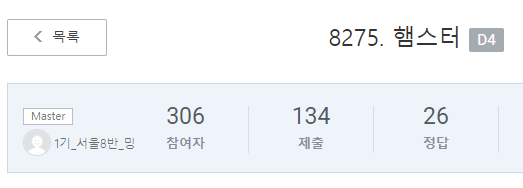

<!--more-->

## 8275. [햄스터 ](https://swexpertacademy.com/main/code/problem/problemDetail.do?contestProbId=AWxQ310aOlQDFAWL&categoryId=AWxQ310aOlQDFAWL&categoryType=CODE)


> 처음으로 마스터를 해봤다   
> 보면 알겠지만 정답이 26개 밖에 없어서 할 수 있었다   
> 그래도 매우 기뻤다... 이틀정도   
> 젤리초가 바로 뺏어버렸다 ㅠ_ㅠ   


``` java
import java.io.BufferedReader;
import java.io.InputStreamReader;
import java.util.Arrays;
import java.util.Comparator;
import java.util.StringTokenizer;

public class Solution  {
	static int T, N, X, M, l, r, s;
	static int max, info[][], hamzzi[], ans[];
	static int currentIdx;

	static StringTokenizer st;

	public static void main(String[] args) throws Exception {
		BufferedReader in = new BufferedReader(new InputStreamReader(System.in));

		T = Integer.parseInt(in.readLine().trim());
		for (int test_case = 1; test_case <= T; test_case++) {
			st = new StringTokenizer(in.readLine());

			N = Integer.parseInt(st.nextToken());
			X = Integer.parseInt(st.nextToken());
			M = Integer.parseInt(st.nextToken());

			hamzzi = new int[N];
			info = new int[M][3];
			ans = new int[N];
			max = -1;
			for (int i = 0; i < M; i++) {
				st = new StringTokenizer(in.readLine());
				info[i][0] = Integer.parseInt(st.nextToken()) - 1;
				info[i][1] = Integer.parseInt(st.nextToken()) - 1;
				info[i][2] = Integer.parseInt(st.nextToken());
			}

			Arrays.sort(info, new lastCageComparator());

			combi(0, 0, 0);

			if (max == -1) {
				System.out.println("#" + test_case + " -1");
			} else {
				System.out.print("#" + test_case);
				for (int i = 0; i < N; i++) {
					System.out.print(" " + ans[i]);
				}
				System.out.println();
			}
		}
	}

	private static boolean check(int index) {
		int sum = 0;
		for (int i = info[index][0], size = info[index][1]; i <= size; i++) {
			sum += hamzzi[i];
		}
		if(sum!=info[index][2]) {
			return false;
		}

		return true;

	}

	private static void combi(int count, int start, int index) {
			
			for(; index<M && count==info[index][1]+1; index++) {
				if(!check(index)) {
					return;
				}
			}
		if (count == N) {
			int hamzziSum = 0;
			for (int i = 0; i < N; i++) {
				hamzziSum += hamzzi[i];
			}
			if (max < hamzziSum) {
				max = hamzziSum;
				copy();
			} else if (max == hamzziSum) {
				for (int j = 0; j < N; j++) {
					if (hamzzi[j] < ans[j]) {
						copy();
					} else if (hamzzi[j] == ans[j]) {
						continue;
					} else {
						break;
					}
				}
			}
			return;
		}
		for (int i = start; i <= X; i++) {
			hamzzi[count] = i;
			combi(count + 1, start, index);
		}
	}

	private static void copy() {
		for (int j = 0; j < N; j++) {
			ans[j] = hamzzi[j];
		}		
	}

}

class lastCageComparator implements Comparator<int[]> {
	@Override
	public int compare(int[] o1, int[] o2) {
		return o1[1] - o2[1];
	}
}

```
