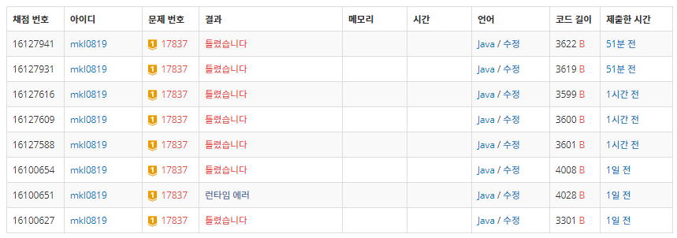
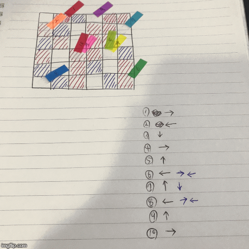

<!--more-->

## 17837. [새로운게임2](https://www.acmicpc.net/problem/17837)

<p style="color:red; font-size: 30px;">
이것은 미해결 된 문제입니다.
</p>



1번의 런타임 에러 (package 실수) 와**7번**의 오답 기록을 보유했다.   
'못 푼 문제를 왜 올리냐' 라고 할 수도 있지만 너무 억울하고 도저히 해결방법을 찾을 수 없어서...   
그렇다고 내가 열심히 풀어본 내새끼를 버릴 순 없어서   
백준에서 안받아주니까 여기서라도 맘껏 제출하려고 올려본다.   
누구든지 할 일없고 시간 많으면 이 문제를 해결해주세요.. 제발...    

예상컨데 아주 작은 실수일 것 같다.   
테스트 케이스는 모두 맞는데 **7%** 에서 멈추는 것은 내가 모르고 지나친 조건이 있을 것이다.   

처음엔 틀린 부분을 찾아서 고쳤다.   
`if( count < 1000 )` 인데 `if( count <= 1000 )` 라고 했던 것을 고쳤고,   
` 1 / 2 / 3 ` 에서 `2` 번 말을 옮길 경우 ` 2 / 3 ` 만 옮기는 것인데 다 옮겼었고,   
이 친구들을 고치고 나서 제출했을 때 받았던 <span style="color:red">틀렸습니다</span> 는 이전보다 더 충격적이었다.   

하지만 계속해서 문제를 찾기 위해 노력했다.
위의 실수(실수가 반복되면 실력 ^^) 들을 처음엔 못찾았던 것 처럼,   
분명히 작은 실수(나의 실력 ^^) 가 숨어있는데 말이야...   

   
결국 시간을 들여서 직접 해보기까지 했는데 (재밌었다)   
디버깅 출력 찍은 것과 일치했으며 난 잠정적 포기를 하기로 했다.   
조금 더 머리를 새롭게 세척한 후에 다시 도전해보려고 한다.   
이상 나의 기나긴 실패(성공의 어머니) 이야기였다.   

``` java
import java.io.BufferedReader;
import java.io.InputStreamReader;
import java.util.ArrayList;
import java.util.HashMap;
import java.util.List;
import java.util.Stack;
import java.util.StringTokenizer;

public class Main {
	static final int RIGHT = 1, LEFT = 2, UP = 3, DOWN = 4;
	static final int WHITE = 0, RED = 1, BLUE = 2;

	static int N, K, map[][];
	static int dir[][] = { {}, { 0, 1 }, { 0, -1 }, { -1, 0 }, { 1, 0 } };

	static HashMap<Integer, ArrayList<Integer>> info;
	static List<Integer> subStack;
	static Marker markers[];

	static StringTokenizer st;

	public static void main(String[] args) throws Exception {
		BufferedReader in = new BufferedReader(new InputStreamReader(System.in));
		st = new StringTokenizer(in.readLine());

		N = Integer.parseInt(st.nextToken());
		K = Integer.parseInt(st.nextToken());

		map = new int[N + 1][N + 1];

		info = new HashMap<>();
		markers = new Marker[K + 1];

		for (int i = 1; i <= N; i++) {
			st = new StringTokenizer(in.readLine());
			for (int j = 1; j <= N; j++) {
				map[i][j] = Integer.parseInt(st.nextToken());
				info.put(i * 100 + j, new ArrayList<Integer>());
			}
		}

		for (int i = 1, r = 0, c = 0, d = 0; i <= K; i++) {
			st = new StringTokenizer(in.readLine());
			r = Integer.parseInt(st.nextToken());
			c = Integer.parseInt(st.nextToken());
			d = Integer.parseInt(st.nextToken());
			markers[i] = new Marker(i, r, c, d);
			info.get(key(r, c)).add(i);
		}

		int count = 0;

		while (count++ < 1000) {
			for (int i = 0; i < args.length; i++) {

			}
			for (Marker m : markers) {
				if (m == null)
					continue;
				if(move(m)) {
					System.out.println(count);
					return;
				}
			}
		}
		System.out.println(-1);

	}

	private static boolean move(Marker m) {

		int dr, dc, dkey;
		dr = m.r + dir[m.d][0];
		dc = m.c + dir[m.d][1];
		dkey = key(dr, dc);

		// blue or out
		if (!check(dr, dc) || map[dr][dc] == BLUE) {
			m.d = change(m.d);
			dr = m.r + dir[m.d][0];
			dc = m.c + dir[m.d][1];
			dkey = key(dr, dc);
		}

		if (!check(dr, dc)) {
			dr = m.r;
			dc = m.c;
			dkey = m.key;
			m.d = change(m.d);
		} else {

			switch (map[dr][dc]) {
			case WHITE:
				subStack = stackSplit(m.key, m.index);
				info.get(dkey).addAll(subStack);
				info.get(m.key).removeAll(subStack);
				break;
			case RED:
				subStack = stackSplit(m.key, m.index);
				for (int i=subStack.size()-1; i>=0; i--) {
					info.get(dkey).add(subStack.get(i));
				}
				info.get(m.key).removeAll(subStack);
				break;
			case BLUE:
				dr = m.r;
				dc = m.c;
				dkey = m.key;
				m.d = change(m.d);
				break;
			}
		}
		
		
		m.r = dr;
		m.c = dc;
		m.key = dkey;
		
		if(4<=info.get(dkey).size()) {
			return true;
		}
		
		for(Integer i: info.get(m.key)) {
			markers[i].r = m.r;
			markers[i].c = m.c;
			markers[i].key = m.key;
		}

		return false;
	}

	private static List<Integer> stackSplit(int key, int index) {
		return info.get(key).subList(info.get(key).indexOf(index), info.get(key).size());
	}

	private static int change(int d) {
		switch (d) {
		case UP:
			return DOWN;
		case DOWN:
			return UP;
		case RIGHT:
			return LEFT;
		case LEFT:
			return RIGHT;
		}
		return 0;
	}

	private static boolean check(int dr, int dc) {
		if (dr == 0 || dc == 0 || dr == N + 1 || dc == N + 1)
			return false;
		return true;
	}

	private static int key(int r, int c) {
		return r * 100 + c;
	}

	static class Marker {
		int index, r, c, d, key;

		public Marker() {
			super();
		}

		public Marker(int index, int r, int c, int d) {
			super();
			this.index = index;
			this.r = r;
			this.c = c;
			this.d = d;
			this.key = key(r, c);
		}
	}
}

```
