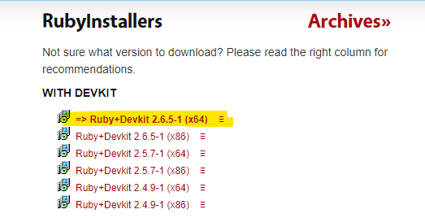
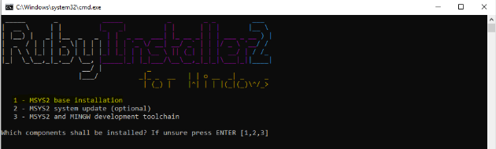
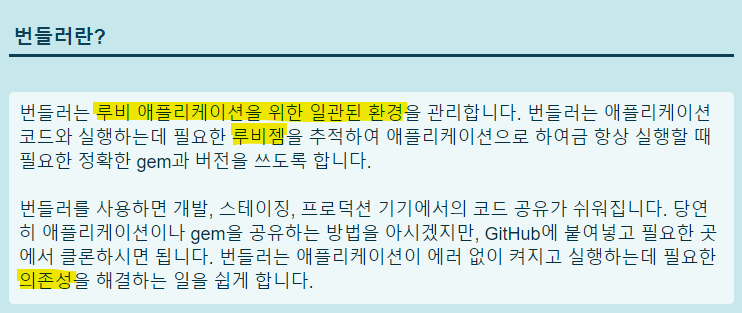

<!--more-->
이 블로그는 **gitHub page** 블로그이다.   
정적 웹사이트.    
즉, DB나 댓글을 따로 관리하지 않고 오직 내 포스팅만 올리는 일방적인 블로그이다.   
사실 무작정 블로그가 하고싶어서 알아보았고 그 중 jekyll을 발견해서 사용중이었다.   
처음엔 신기하고 좋았지만 불편한 점이 몇 가지 있었다.   

> 1. PUSH를 한 후에야 변경사항이 적용된다는 것.    
>   (왜냐면 local에서 돌릴 생각을 하지 않았기 때문 ^^;)    
> 2. 정해진 theme (이 곳은 hydejack)의 스타일이 마음에 들지 않는 것.   
>   (이것도 변경할 수 있었지만 local에서 작업하는 법을 몰라 시도하지 않았기 때문 ^^;)    

이렇게 보면 불편한 점이 아니라, 알아보기 귀찮아서 모른척 했던 나의 게으름이었다.   

사실 **Disqus** 댓글 적용도 해야지 해야지 하다가 얼마전에야 만들었다.   
이런 저런 점을 반성하며 local 작업 세팅을 마친 기념으로
앞으로 블로그 관련 포스팅도 해보려고 한다.!     


# 1. Ruby Download

jekyll 블로그는 **ruby** 기반이다.    
local에서 작업하지 않으면 굳이 ruby를 설치하지 않아도 되더라.    
하지만 너무 불편했었기 때문에 더 풍성한 블로그 활동을 위해서 함께 [ruby를 설치](https://rubyinstaller.org/downloads/)하자!    
   
    
나는 노란 친구를 다운받았다.   
   
   
    
실행파일을 열어서 설치를 마치면 Ruby command 창이 뜬다.   
3가지 선택지 중 1을 입력하고 ruby 설치를 마친다!   

# 2. Bundle Install

**ruby** 설치를 끝냈다면 이제 **bundle**을 설치해야한다.   

```cmd
bundle install
```
cmd 창을 열고 본인 블로그 경로에서 설치를 진행한다.   
   

    
[번들러 홈페이지](https://ruby-korea.github.io/bundler-site/)에 가보면 이런 소개글이 써있다.   
아직은 잘 모르지만 의존성을 해결한다, rubygem을 추적한다는 말로 보아서 프로젝트를 위한 환결설정을 하는 명령인 것 같다.   
점점 **Ruby**에 대해서 알아야겠다는 생각이 든다..   

# 3. bundle exec jekyll serve

우선 목표는 **블로그를 로컬에서 작업해보자!** 이기 때문에 계속 해보겠다.   

```cmd
bundle exec jekyll serve
```
`bundle install`이후에 위 명령어를 입력하면 드디어 local에서 실시간으로 내 블로그가 어떻게 배포될 것인지 확인할 수 있다.   
기본포트는 *http://localhost:4000* 이고 포트 번호는 `package.json` 파일의 `config.port`에서 변경할 수 있다.   


이제 얼마든지 local에서 확인하면서 작업할 수 있으니 더 꾸준하게 블로그를 해야겠다. (화이띵)   

