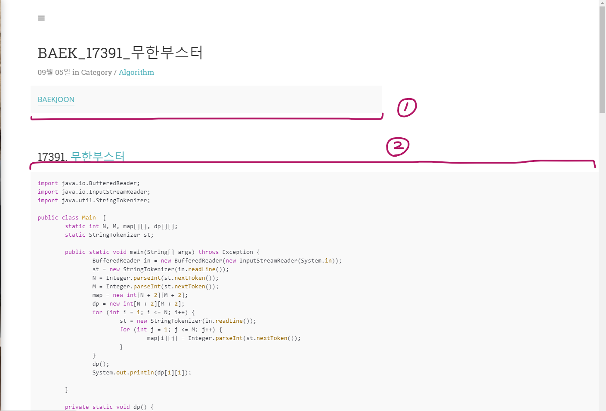
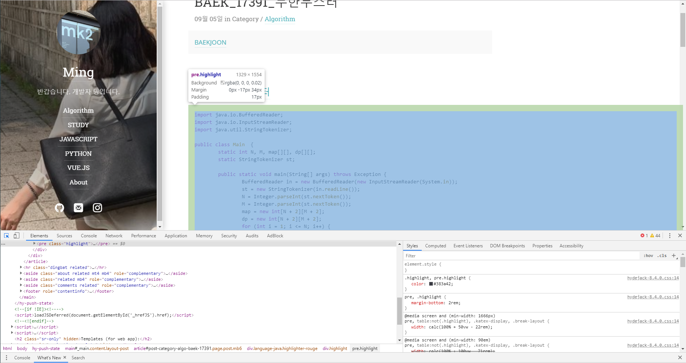
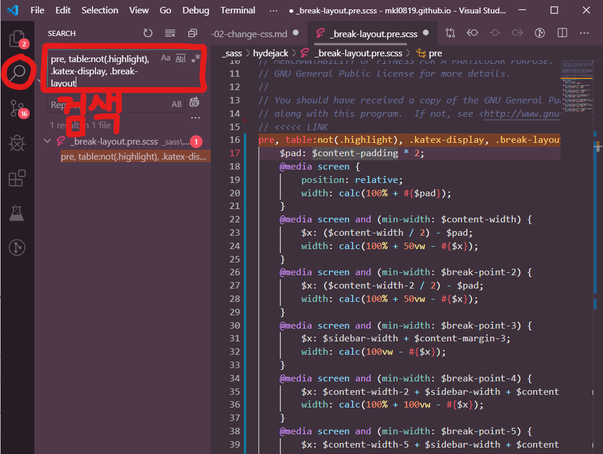
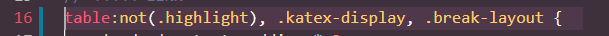
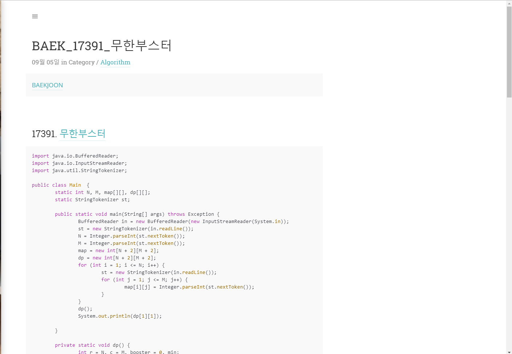

<!--more-->
[블로그를 local에서 돌릴 수 있게 되었으니](https://mkl0819.github.io/category/blog/2019-10-27-running-locally/)   
내가 가장 하고 싶었던 작업을 할 것이다.   

사실 처음 이 **Hydejack** 테마는 꽤 마음에 들었었다.   
그런데 계속 쓰다보니 특유의 흐리멍텅한, 선명하지 않은 하이라이팅 색상이라던지, 약간의 불편한 스타일이라던지, 내 취향이 아닌 폰트라던지...   
뭔가 정의할 수 없지만 **딱** 마음에 들지 않았다.   

그 중 가장 거슬렸던 **code block**의 너비..   
나는 약간 이상한 곳에 꽂히는 경향이 있기 때문에 공감이 되지 않겠지만.. ㅎㅎ   
처음부터 굉장히 날 거슬리게 했단 말이지 🤔   
그럼 **code block**의 **style**을 수정하면서 어떤 방식으로 블로그를 커스터마이징하는지 알아보자!!   

# 1. 마음에 안드는 부분에 적용된 css 찾아내기
   

   
나는 이 부분이 마음에 안 들었다.   
code를 올릴 때면 항상 `2`번 처럼 전체너비를 차지하는 것이 비율이 맞지 않고 나를 불편하게 만들었다.   
저 부분만 있으면 괜찮은데 하필 `1`번처럼 편안한 생김새를 가진 곳이 있어서 더욱 비교가 되었다.   

   
   
그럴 땐 `F12`를 눌러 개발자 도구를 켠 다음 해당 부분의 태그를 알아낸다.   
그리고 어떤 **class**의 **style**이 범인인지 찾아낸다.   
   
   
   
나같은 경우에는 `<pre />` 태그의 이 부분이었다.    
개발자 도구의 **Styles** 탭에서 수정해보면서 원하는 스타일을 찾을 수 있다.    
   
   
# 2. 해당 css 파일 찾아내기
   
자, 그럼 어떤 파일이 이 **style**을 적용시킨 것인지 알아내기 위해 같이 적용된 클래스 묶음을 검색한다.   
   

   
내가 사용하는 **vscode**에서는 사이드의 돋보기 탭에서 검색을 하면 루트의 모든 파일에서 단어를 검색할 수 있다.   
   

# 3. 원하는 style 적용하기
   
찾아낸 파일에서 내가 수정하고 싶은 부분을 수정한다.   
   

   
나는 일단 `<pre />` 태그 부분만 삭제하고 나머지는 그대로 두었다.  
   

   
그리고 local에서 실행시켜보면 ([local에서 실행시키는 법](https://mkl0819.github.io/category/blog/2019-10-27-running-locally/)) 이렇게 깔끔하게 원하는 대로 적용된 것을 알 수 있다!   
   
   

앞으로 할 일 !   
> 1. 흐리멍텅한 Highlight color 수정하기    
> 2. font 변경하기   
> 3. sub-category 만들기   
