<!--more-->

구글링을 하다보면 다양한 github page 블로그를 볼 수 있다.   
다른 사람들도 검색을 통해서 내 블로그에 올 수 있으면 좋겠다는 생각이 들었다.   
그래서 구글 검색엔진에 내 블로그를 등록하였고 이를 설명하고자 한다!!   


## 1. **google search console**에 URL 등록


우선, 준비물은 자신의 **블로그**이다.  
그리고 [google search console](https://search.google.com/search-console/welcome) 에 들어가서 본인의 블로그 URL을 등록해야한다.   
   
    
오른쪽에 있는 **URL 접두어** 박스에 블로그 도메인 주소를 적고 `계속` 버튼을 누른다.   

## 2. **HTML** 파일 설정
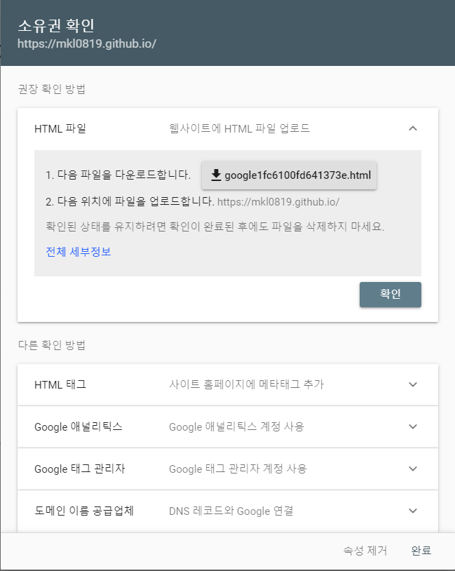   
그러면 **소유권 확인**이라는 창에서 `google뭐시기.html` 파일을 다운로드한다.   
   
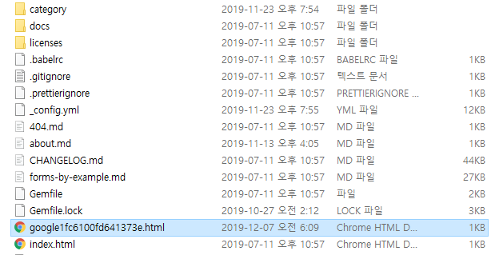   
그리고 github blog 의 루트위치에 해당 파일을 복사한다.    
(앞으로 파일을 생성하거나 작성하는 위치는 모두 **루트**위치이다.)

## 3. **sitemap.xml** 파일 생성   
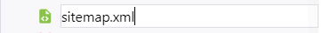    
같은 위치에 `sitemap.xml`이라는 파일을 생성한다.   

```xml
---
---
<?xml version="1.0" encoding="UTF-8"?>
<urlset xmlns="http://www.sitemaps.org/schemas/sitemap/0.9">
    
    <url>
        <loc>{{ site.url }}{{ post.url | remove: 'index.html' }}</loc>
    </url>
    

    
    
    
    <url>
        <loc>{{ site.url }}{{ page.url | remove: 'index.html' }}</loc>
    </url>
    
    
    
</urlset>
```


## 4. **feed.xml** 파일 생성
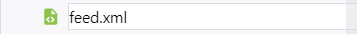   
`feed.xml` 파일을 생성한다.

```xml
---
layout: null
---
<?xml version="1.0" encoding="UTF-8"?>
<rss version="2.0" xmlns:atom="http://www.w3.org/2005/Atom">
  <channel>
    <title>{{ site.title | xml_escape }}</title>
    <description>{{ site.description | xml_escape }}</description>
    <link>{{ site.url }}{{ site.baseurl }}/</link>
    <atom:link href="{{ "/feed.xml" | prepend: site.baseurl | prepend: site.url }}" rel="self" type="application/rss+xml"/>
    <pubDate>{{ site.time | date_to_rfc822 }}</pubDate>
    <lastBuildDate>{{ site.time | date_to_rfc822 }}</lastBuildDate>
    <generator>Jekyll v{{ jekyll.version }}</generator>
    
      <item>
        <title>{{ post.title | xml_escape }}</title>
        <description>{{ post.content | xml_escape }}</description>
        <pubDate>{{ post.date | date_to_rfc822 }}</pubDate>
        <link>{{ post.url | prepend: site.baseurl | prepend: site.url }}</link>
        <guid isPermaLink="true">{{ post.url | prepend: site.baseurl | prepend: site.url }}</guid>
        
        <category>{{ tag | xml_escape }}</category>
        
        
        <category>{{ cat | xml_escape }}</category>
        
      </item>
    
  </channel>
</rss>
```


## 5. **robots.txt** 파일 생성
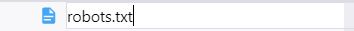   
`robots.txt` 파일을 생성한다.

```txt
User-agent: *
Allow: /

Sitemap: https://mkl0819.github.io/sitemap.xml
```


**Sitemap** 은 https://**본인블로그도메인**/sitemap.xml`로 작성한다.   

## 6. **_config.xml**의 url 설정
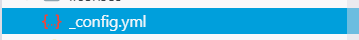   
마지막으로 같은 위치에 있는 설정 파일인 `_config.xml`을 열고   
   
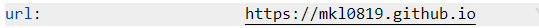   
`url`에 본인의 블로그 도메인이 매칭되어 있는지 확인한다.   
(안되어 있으면 바꾸세용!)   
   
## 7. push하고 sitemap 제출
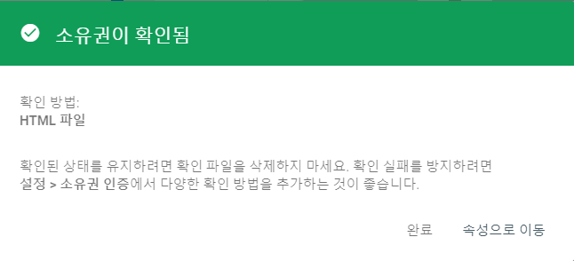   
이제까지의 내용을 **push**한 후 다시 [google search console](https://search.google.com/search-console/)에 가면 위처럼 `소유권이 확인`되었다는 것을 볼 수 있다.

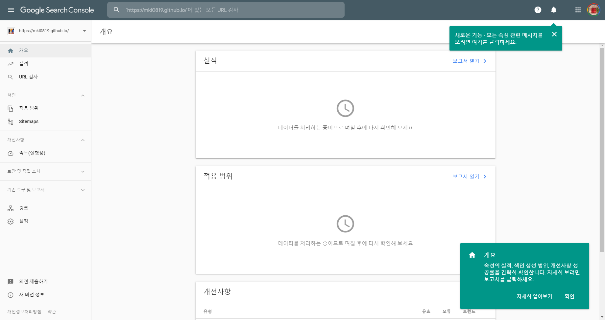 
소유권 확인이 된 것을 보고 다시 접속하게 되면 이렇게 대시보드가 나온다.   
왼쪽 메뉴 중 **site map**으로 들어간다.   
   
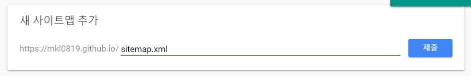   
**새 사이트맵 추가**에서 `sitemap.xml`을 제출한다.
   
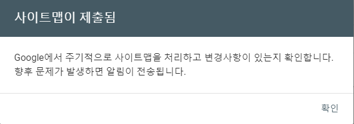   
그럼 이렇게 사이트맵이 제출되었다고 뜨고    
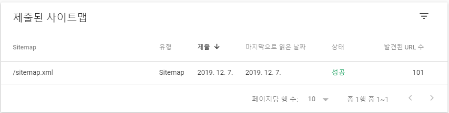   
표의 오른쪽에서 **성공** 표시를 볼 수 있다.   

## 8. 검색해보기 😆
진짜진짜 마지막으로 실제로 구글 검색을 해보자!!!!   
모든 설정을 마친 뒤 바로 검색했을 때는 나오지 않았다.   
그래서 1~2시간 정도 있다가 다시 검색을 했더니..
(내가 작성했던 포스팅 제목 검색)

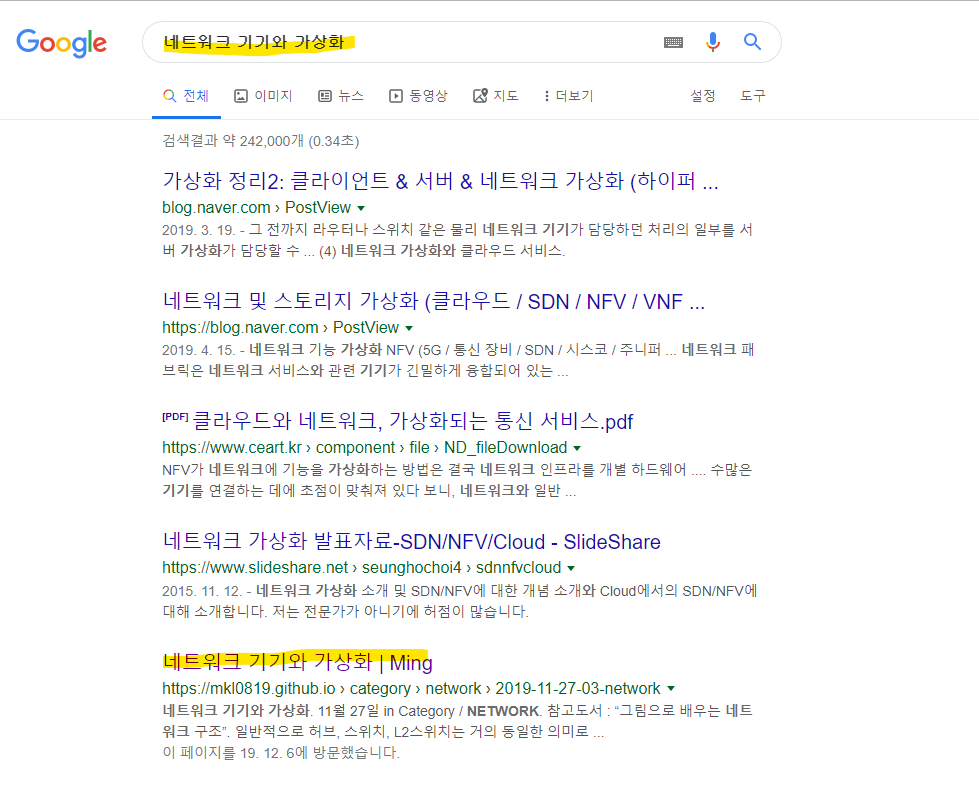   
**쨔쨘~~~!!!~!~!~!**   
이렇게 내 블로그를 구글 검색에서 볼 수 있다.   
다른 사람들이 이미 많이 했던 포스팅같은 경우에는 검색해도 내 블로그를 볼 수가 없었다.   
아마 순위가 밀려서이지 않을까?   
앞으로 더 자주 좋은 글을 적어서 구글 검색이 잘 되도록 해봐야겠당!