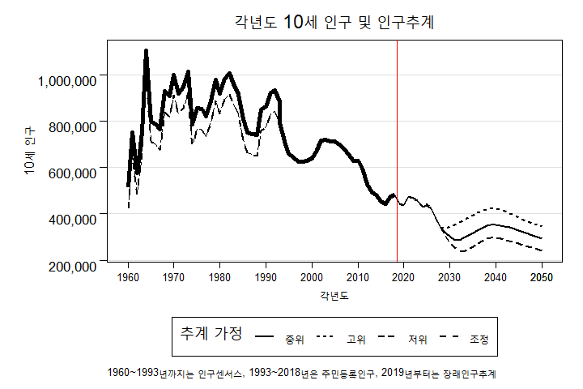

<!--more-->

지난 수 년간 계속 되어온 논의 중 하나는 바로 근로시간이다.

주52시간제와 주5일제 등이 법과 정부정책으로 기업에 강제되면서 오늘날 대한민국에서 주 52시간, 즉 주 5일간 40시간 동안 일하는 것이 당연시 되었다. 기업에서는 당연히 해당 정책을 따르는데 난색을 표할 수 밖에 없다. 투입할 수 있는 고용이 줄어들 수록 생산할 수 있는 제품은 줄어들기 때문이다. 그리고 상당히 많은 기성세대 분들은 이러한 고용정책의 방향성에 의문을 가질뿐만 아니라, 긍정적으로 받아들이기 어려워 한다. 대부분의 기성세대들은 자신들이 겪은 경제 성장은 어디까지나 밤낮없이 일하며 쌓아올린 결과물이였기 때문이다. 이러한 기성세대들의 노력과 결과물에 대해 부정할 생각은 없다. 그러나 21세기에 들어오면서 몇 가지 커다란 변화가 발생하였고, 이는 왜 주52시간 및 5일제 뿐만 아니라 장기적으로 주4일제 또한 고려해야 하는 근거가 되었다. 그리고 이러한 변화를 설명하지 않는다면, 현재의 고용정책에 반대를 표하는 사람들을 설득하기 어렵다.

# 무엇이 변화하였는가?
## 1. 출산율의 감소(청년인구의 감소)
80년대 중반 이후부터 태어난 세대들과 그 이전 세대들을 가르는데 가장 결정적인 차이는 인구구조와 기술이라 생각한다. 구체적으로는 유아기부터 10대, 즉 학창시절에 경험한 인구구조와 기술이라 할 수 있다. 두 자녀 정책 이전에 기성세대들은 한 가정에 3,4명 이상의 형제가 있는 것은 일반적이였다. 나만 해도 아버지의 형제들만 여섯 분이 계신다. 그런데 80년대부터 본격적으로 시작된 '아들딸 구별없이 두 자녀' 정책은 90년대 중반에 들어오면서 입법입안자들조차 예상하지 못한 방향으로 흘렀다. 뜨거운 교육열과 출산율의 급격한 저하가 바로 그것이다.

위의 그래프는 각 년도별 10세 인구를 보여주는데, 보이는 것과 같이 1990년부터, 즉 1980년대생들부터 빠르게 그 수가 줄어드는 것을 볼 수 있다. 1980년대까지 90만명 이상을 유지하던 10세 인구는 2019년에 50만명 미만의 수치를 보이며 학력인구가 거의 반토막이 났다는 것을 알 수 있다. 더군다나 수능으로 인해 교육열은 그 어느때보다 뜨거워졌고, 이러한 현상으로 인해 양육비는 교육비와 더불어 빠르게 증가했다. 

### 1.1. Solow 성장모델
경제모델 중 유명한 모델은 Solow Growth Model이다. 적당한 인구증가는 경제의 성장을 촉진하나, 과도하면 경제를 위축시킬 수 있다는 것이다. 박정희-전두환에 걸친 경제정책들은 성공적이였고, 가구소득은 증가하였다. 상당수의 학자들과 입법입안자들은 Solow 모델을 신뢰하고 있었고, 적당한 선에서 출산율을 조절할 필요가 있다고 여겼다. 그래서 다양한 피임기술 개발 및 교육을 확대하였고, 두 자녀 정책 등 다방면으로 출산율을 떨어뜨리기 위해 많을 노력을 가하였다. 이러한 측면에서 출산율 감소 정책은 결과론적으로 성공적이였다 할 수 있다. 

### 1.2. 더이상 여성은 주 소비자가 아니다

## 2. 정보통신 기술의 발달(단순통신업에서 융합기술로)

## 3. 