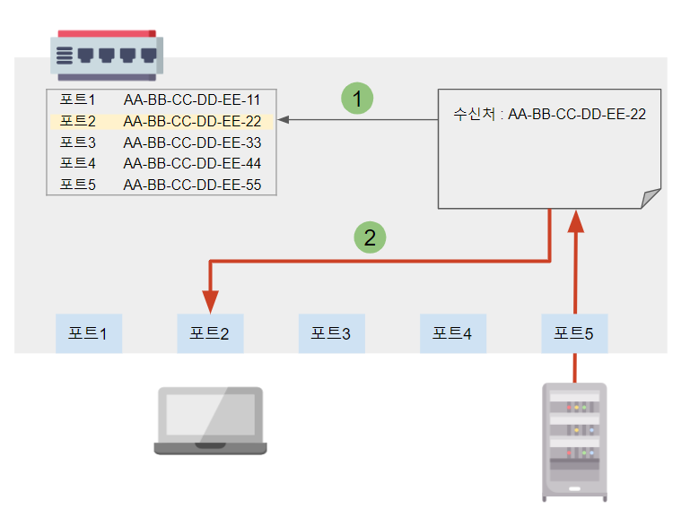
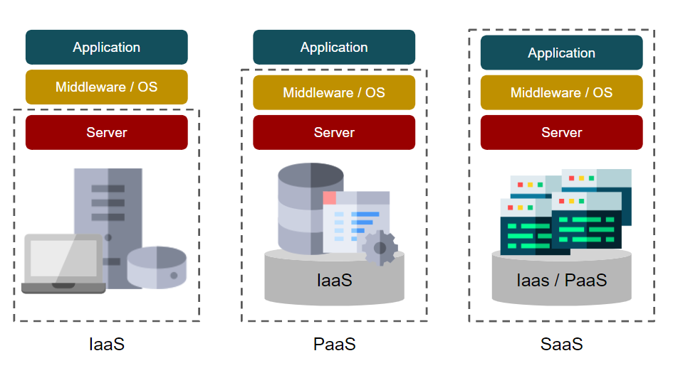

<!--more-->

> 일반적으로 허브, 스위치, L2스위치는 거의 동일한 의미로 사용
> 허브 :  이더넷을 확장하기만 하는 단순한 기능
> 스위치 : 각종 관리 기능 + VLAN 기능 등 다기능 기기

|||
|---|---|
|L2 스위치|이더넷의 MAC주소를 보고 할당한다.|
|L3 스위치|IP의 IP 주소를 보고 할당한다.|
|L4 스위치|TCP나 UDP의 포트 번호 등을 보고 할당한다.|

## 01. L2 스위치
: 수신한 프레임의 수신처 MAC주소를 받아서 접속되어 있는 포트로 이더넷 프레임을 송출
   

① **MAC 주소 테이블**에서 수신처 MAC 주소에 대응하는 포트번호를 찾음   
② 접속되어 있는 해당 포트로 데이터를 전송
③ 수신처 MAC 주소가 테이블에 없는 경우   
  - 송신처를 제외한 모든 포트로 데이터를 전송 : **follding**
  - 연결된 포트 번호와 MAC주소를 테이블에 등록

## 02. L3 스위치
- IP 패킷을 처리하는 스위치
- 스위치 내의 VLAN끼리 연결하기 위해 L2스위치에 라우터 기능을 포함한 것
- L3 스위치에 문제가 발생할 경우
    - 라우팅 기능과 스위치 기능 둘 다 사용 X

## 03. 무선 LAN
- LAN 케이블 대신 무선을 사용해서 네트워크에 접속하는 기술
- 유선 LAN 보다 보안에 취약 (IEEE 802.1X 인증으로 보완)
- **WAP**, **WAP2**, **AES**를 이용해서 암호화

## 04. VLAN
: 물리적으로 한 개의 네트워크를 논리적으로 여러 개의 네트워크로 분할하는 기술

### 1) 포트 기반 VLAN
- 라우터에 탑재되어 있는 포트를 그룹으로 지정해서 하나의 LAN처럼 보이게 하는 기술
- 스위치나 라우터가 보유한 기능으로 LAN 분할 기능으로 불리기도 함
- 가정용 스위치나 Wi-Fi라우터는 이 기능이 없음

### 2) 태그 기반 VLAN
- LAN 케이블 한 개 내에 여러 개의 LAN 정보를 보내는 기술
- IEEE 802.1Q는 이더넷 프레임 내에 VLAN 번호를 나타내는 태그를 내장해서 송출
- 태그 기반 VLAN은 포트기반 VLAN과 **조합**해서 사용

## 05. VPN
: Virtual Private Network, 기존 네트워크 내에 가상 네트워크를 만드는 기술

- LAN형 : 비교적 규모가 작은 네트워크를 대형 네트워크에 참가시키는 방식
- 리모트형 : 모바일 회선으로 네트워크에 접속하는 형태

### 터널 기술
- 통신회선 내에 만들어진 **가상** 통신회선
- 터널 프로토콜 : PPTP(Point-to-Point tunnerling Protocol), L2TP(Layer 2 Tunneling Protocol)
- 암호화 프로토콜 : IPsec, IKE, ESP, AH 등

## 06. 가상화
- 물리적인 네트워크나 컴퓨터를 사용해 **논리적인** 네트워크, 컴퓨터를 만들어내는 기술
- 네트워크의 가상화 기술 = VLAN
- 가상화의 장점
    - 물리적인 장비에 제약을 받지 않고 기능 이용이 가능
    - 필요에 따라 규모확장/축소가 쉬움
    - **clouding computing**
- 1개의 물리적인 장비를 여러개의 논리적인 장비로
- 여러개의 물리적인 장비를 1개의 논리적인 장비로

### **Cloud**
- 가상화된 장치나 서비스를 Web 화면 등에서 자유롭게 조합하여 네트워크를 통해 사용

1. IaaS (Infrastructure as a Service)
- 가상화된 컴퓨터나 네트워크를 제공

2. PaaS (Platform as a Service)
- 프로그램 실행 환경, DB, UI 등을 서비스화해서 제공
- 사용자는 컴퓨터 본체가 아니라 호출해서 서비스를 사용

3. SaaS (Software as a Service)
- 완성된 소프트웨어를 네트워크를 경유해서 제공
- 전자메일, 그룹웨어, 스프레드시트 등
