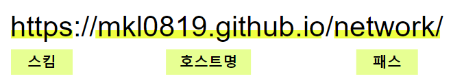
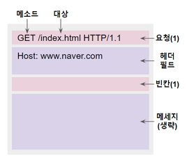
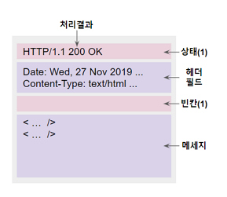
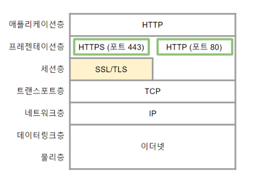
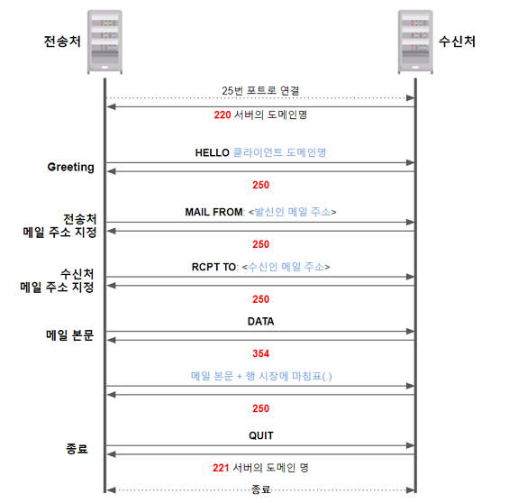
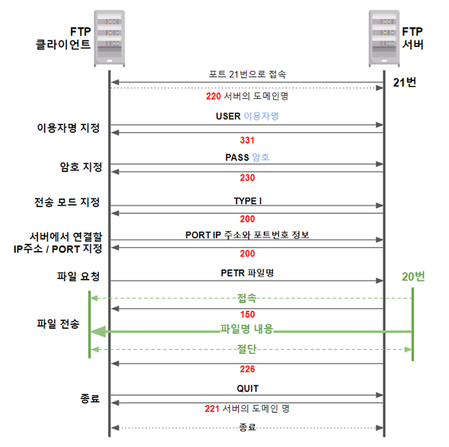
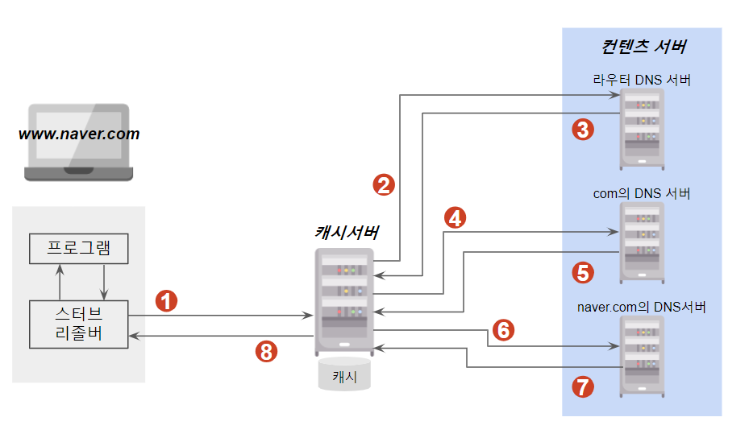

<!--more-->

## 01. Web

**Hypertext**
- 네트워크 경유로 열람할 수 있는 인터넷 서버에 올린 문서
- Hyperlink : 하이퍼텍스트 문서와 연계된 링크

**URL** (Uniform Resource Locator)

- 스킴 : 사용 프로토콜을 정의
- 호스트명 : 접속할 컴퓨터의 명칭이나 IP 주소
- 패스 : 서버 내의 저장 위치

|protocol|의미|
|---|---|
|http|암호화하지 않은 Web|
|https|암호화한 Web|
|ftp|파일 전송|
|mailto|메일 전송 등|

- 정적 컨텐츠
    - 미리 제작해서 서버에 보존되어 있는 컨텐츠
- 동적 컨텐츠
    - 서버에서 읽기 요청 시 프로그램이 동작해서 만들어내는 컨텐츠

### 1) HTTP
> Hypertext Transfer Protocol (port 80)    
> Web 서버와 Web 클라이언트간 Web 정보를 주고받기 위한 프로토콜       
> 요청 시 응답하는 (1:1) 단순한 형태     

1) HttpRequest

|메소드|의미|
|---|---|
|HEAD|타겟의 헤더 정보를 가져옴|
|GET|타겟을 가져옴|
|POST|타겟에 데이터를 전달|
|PUT|서버 내에 파일을 작성|
|DELETE|서버 내의 파일을 삭제|

2) HttpResponse

|상태코드|의미|
|---|---|
|200|정상|
|401|인증 필요
|404|찾을 수 없음
|408|요청 시간 초과
|500|서버 내부 오류

### 2) HTTPS
> Hypertext Transfer Protocol Secure (port 443)     
> SSL/TLS + HTTP    

1. HTTPS의 장점
- HTTP 기반 통신이기 때문에 간단하면서 범용성이 높음
- **암호화** : HTTP의 요청, 응답 암호화
- **조작 검사** : 통신 내용 변경 시 조작한 사항 검사 가능
- **인증** : 접속하고 있는 Web서버의 진위여부 검증

    
2. SSL (Secure Sockets Layer)
3. TLS (Transport Layer Security)

## 02. 메일 관련 프로토콜

### 1) SMTP
> Simple Mail Transfer Protocol (port 25)    
> **메일 전송** 프로토콜     
> HTTP 통신과 달리 여러 번의 통신이 필요      

      

### 2) POP3
> Post Oice Protocol Version 3 (port 110)      
> 메일함의 메일을 PC에 넣고 PC 내에서 정리, 열람      
> PC에 보관하기 때문에 네트워크의 연결이 없으면 열람 불가      

### 3) IMAP4
> Internet Message Access Protocol Version-4 (port 143)      
> 메일을 서버상의 메일함에 둔 상태에서 정리, 열람      
> 메일 서버에 접속만 가능하면 모든 단말에서 동일 메일 열람 가능      

## 03. 파일 관련 프로토콜

### 1) FTP
> File Transfer Protocol      
> 전송 제어   : port 21      
> 전송 데이터 : port 20      

동시에 두 개의 접속 방식을 사용하기 때문에 port 번호가 두 개      

- **active mode**
    - **FTP 클라이언트**가 먼저 **제어용**으로 연결
    - **FTP 서버**가 **데이터 전송용**으로 연결
    - **문제점** : 외부에서의 부정 침입 발생
- **passive mode**
    - **FTP 클라이언트**가 먼저 **제어용**으로 연결
    - **FTP 클라이언트**가 ~~다시~~ **데이터 전송용** 연결
    - 외부에서의 접속을 막기 위한 방법

## 04. SSH
> Secure Shell (port 22)      
> 서버나 네트워크 기기에 접속해서 대상을 **CUI로 조작**      
> **암호화**되어 있으므로 정보 누출을 방지할 수 있음      

1. GUI (Graphical User Interface)
2. CUI (Character-based User Interface)
3. CLI (Command Line Interface)

### 공개 키 인증
- 로그인 시 secret key가 반드시 필요하므로 기계적인 방식으로 해킹이 불가능
- passphrase를 사용하면 이중 보안

## 05. DNS
> Domain Name System      
> 정방향 : 도메인명에서 IP주소      
> 역방향 : IP주소에서 도메인명 (이름 분석 : name resolution)      

- 질의 응답 시 **UDP의 포트 53번**
- DNS서버 간 정보 복제 영역 전송 시 **TCP의 포트 53번**
- 분산 처리

① **캐시서버**에서 www.naver.com 검색      
② **라우터 DNS 서버**에서 도메인명 검색      
③ com의 DNS 서버로 가봐      
④ **com의 DNS 서버**에서 도메인명 검색      
⑤ naver.com의 DNS 서버로 가봐      
⑥ **naver.com의 DNS 서버**에서 도메인명 검색      
⑦ 123.123.123.123 이야.      
⑧ 캐시에 보관 후 IP주소 전달      

- 스터브 리졸버 (stub resolver) : DNS 질의 프로그램      
- 캐시 서버, 컨텐츠 서버      

## 06. 그 외

### 1) NTP
> Network Time Protocol (port 123)      
> 네트워크 시간 동기화 프로토콜      
> 부하 집중 방지를 위해 NTP서버는 **계층적인 구조**      

### 2) HTTP Proxy
- 네트워크 통신 중계를 담당      
- **캐싱**, **바이러스 검출**, **부정 침입 방지**, **유해 사이트 차단**      

### 3) REST API
> REpresentational State Transfer Application Programming Interface

- 네트워크 경유를 통해 데이터에 접근 가능
- **ASP**(Application Service Provider), **SaaS**, **PaaS**
- HTTP의 네트워크 경유를 통해 XML, JSON 형식의 결과를 돌려주는 형태
- 상태를 갖지 않는 프로토콜
- 정보를 조작할 수단이 충분히 정의
- 리소스는 범용적인 구문으로 식별 가능
- 정보 내에 hypermedia가 포함

### 4) HTML 
> HyperText Markup Language
- Web에서 사용하는 문서 기술 언어
- Web 브라우저에 표시하는 경우 HTTP 요청을 통해 파일 read
- HTTP 요청은 1:1 통신이기 때문에 여러 번의 통신이 필요