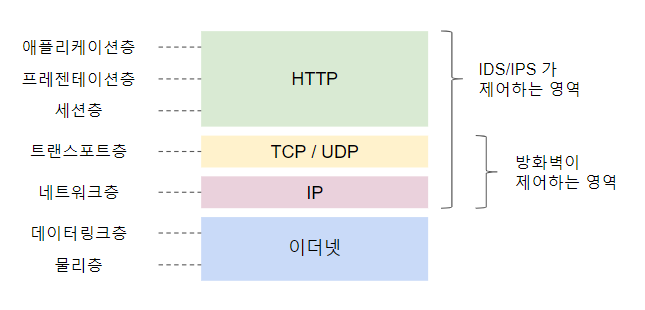

<!--more-->

## 01. 정보 보안

### 1) 기밀성
- Confientiality
- 허가를 받은 사람만 정보를 이용할 수 있음
- 네트워크 도청, 도난, 부정 접속 등의 위협

### 2) 무결성
- Integrity
- 본래의 내용으로 유지
- 정보 조작, 부정 접속으로 인한 조작, 데이터 누락 등의 위협

### 3) 가용성
- Availability
- 적절하게 사용할 수 있는 상태
- DDos 공격, 시스템 고장, 정전 등의 위협

> **취약점**과 **위협**으로 이루어진 **리스크**를 **관리대책**으로 방지

## 02.암호화와 전자증명서

### 1) 공통키 암호
- 데이터 암호화와 복호화에 동일한 키를 사용하는 것
- 연산이 빠름 **but** 보안에 취약

### 2) 공개키 암호
- 데이터 암호화에는 **공개키**를 사용하고, 복호화에는 **비밀키** 사용
- 공개키는 누구나 접근가능하지만 비밀키는 유일
- 계산량이 많음

### 3) 전자증명서
- 악의나 실수고 공개키가 바뀌는 것을 방지
- 이름, 메일 등과 공개키를 **세트**로 묶어 디지털 서명

## 03. 부정 침입/프로그램

### 1) 부정 침입
- 취약성, 설정 미비 등을 노리고 정규 접속 권한이 없는 상태에서 네트워크나 컴퓨터에 숨어드는 것   
- ex) 시스템 조작, 기밀정보 탈취, 정보 제거 및 개서, 스팸메일, DoS   

### 2) 부정 프로그램

|명칭|감염경로|자가증식|재감염|주요피해
|:---:|:---:|:---:|:---:|:---:|
바이러스|메일, 미디어,  Web 접속 등 | O | O | 부정수단 설치, 탈취, 파일 엿보기,  외부접속, 키조작 기록, 시스템 피해 등
웜|네트워크 접속 등| O | X | 시스템 정지, 파일 엿보기, 스팸 메일,  송신, 탈취, 다른 악성 소프트웨어 설치 등
트로이 목마| 애플리케이션, 메일,  미디어, Web 접속 등 | X | - | 부정수단 성치, 탈취, 파일 엿보기,  외부접속, 키조작 기록, 시스템 피해 등
스파이 웨어| 애플리케이션, 메일,  미디어 Web 접속 등 | X | - | 파일 엿보기, 키조작 기록 등

## 04. 보안

### 1) 방화벽
- 중~대규모 네트워크 : 전용 장치
- 소규모 네트워크 : 라우터의 내장 기능
- **패킷 필터형**
  - 방화벽은 인터넷과 내부 네트워크의 경계에 설치
  - 패킷의 IP 주소와 포트번호를 조건으로 통신을 허가/거부
  - 네트워크층과 트랜스포트층 기반으로 통신 제어
  - 정적 필터링 : 항상 고정된 조건으로 방화벽 관리
  - 동적 필터링 : 통신 진행 상황에 따라 조건을 변경
    - stateful packet inspection : TCP 프로토콜의 조건에 부합하는지 확인
- **DMZ**
  - 중간 보호 상태의 네트워크
  - Web 서버나 메일 서버 등 외부로 공개된 서버를 설치 

### 2) 백신
- 주로 메일에 첨부된 바이러스나 스파이웨어 등을 검출해서 제거하는 서비스
- 메일 서버용 / PC용
- 최근 보안 SW는 백신 기능과 별개로 방화벽 기능, 컨텐츠 필터 기능을 겸비
- **signature** : 바이러스의 특징을 기록한 패턴 파일을 비교
- **heuristic** : 안전한 상태로 바이러스를 구동시킨 후 행동 조사
- **컨텐츠 필터링** : 지정 조건을 만족하는 Web 컨텐츠의 관람을 제한하는 기능   
(화이트리스트 / 블랙리스트)

### 3) IDS & IPS

- 방화벽과 다르게 애플리케이션층의 통신 상황을 포함하여 검사
- IDS
  - Intrusion Detection System, 침입 탐지 시스템
  - 이상 검출 시 시스템 관리자에게 메일 등으로 통보
- IPS
  - Intrusion Prevention System, 침입 방지 시스템
  - 이상 접속을 즉시 차단함과 동시에 시스템 관리자에게 메일 등으로 통보
- signature에 따른 부정 검출
  - signature DB를 기반으로 부정 접근을 검출
  - 등록 패턴을 항상 개선할 필요
  - 미지의 공격 검출 불가
- 평소와 다른 상황 감지
  - 평소와 다른 사용법의 경우 오검출 가능성

### 4) UTM
- United Threat Management, 통합 위협 관리
- 방화벽, 백신, 컨텐츠 필터링, IPS, 그 외 기능을 한 대에 모아둔 기기
- 저렴한 비용때문에 관리 공수가 줄어들고 **소규모** 네트워크에서 사용

### 5) 차세대 방화벽
- **중~대규모** 네트워크에서 사용
- 동일 포트 80번을 사용할 경우라도 애플리케이션을 식별해서 필터링
- HTTPS나 SMTP 등 암호화 통신을 복호해서 내용 확인
- UTM과 기능적으로 유사하며 UTM이 발전한 형태

### 6) 그 외
- 소셜 엔지니어링
  - 인간 대 인간의 교환을 통해 기밀정보를 유출
- 표적형 공격
  - 메일에 부정 프로그램 첨부 
  - 특정 조직에서 접속한 때만 부정 프로그램을 장착
  - 외부에서 접속 가능한 백도어 생성

## 05. 보안 정책
- 조직의 보안을 양호하게 유지하기 위한 방침이나 행동
- 관리대책 
  - 기술적인 대책 : 방화벽, 백신, IDS 등
  - 물리적인 대책 : 입퇴실관리, 서버실 잠금 등
  - 인적 대책 : PC나 미디어 반입/출 제한, 메일의 첨부 파일 이용 제한 등
  - **PDCA 주기** : - Plan -> Eo -> Check -> Action