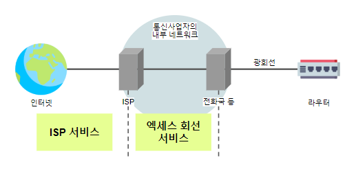

<!--more-->

## 01. 네트워크 구성 설계
> 1. 이용현황 조사
> - 이용자 수 : 서브넷 구성의 기초 자료
> - 이용하는 애플리케이션 : 라우터나 방화벽의 패킷 필터링 설정 
> 2. LAN 구성 설계
> 3. WAN 구성 설계
> 4. 보안 설계
> 5. 모니터링 설계

## 02. 서브넷 구성

### 1) 서브넷 구성
- 소규모 네트워크를 제외하고 보통 서브넷으로 분할하여 구성
- 동일 부서 / 물리적인 거리

### 2) IP 주소 할당
- 보통 사설 IP 주소 할당
- 서브넷별 단말에 맞춰 여유가 있도록 서브넷 마스크 결정

### 3) 라우팅
- 네트워크의 사용법에 따라 특정 서브넷끼리의 통신을 허용
- 각 라우터의 라우팅 테이블 또는 필터에 설정

## 03. HW, SW 설정

### 1) 네트워크 기기
- 안정성, 상호접속성, 성능, 기능, AS, 가격

### 2) 서버
- CPU의 종류, 메모리 용량, 하드디스크 크기, RAID 방식, 네트워크 인터페이스의 속도 등
- **클라우드**
    - 보안, 사내 네트워크에서의 접속, 반응속도, 이용로 등
    - 계약 후에도 사양 변경이 가능
- **op-premise**
    - 설치 장소, 재난 대책, 백업 방식

## 04. 엑세스 회선 / ISP

> 인터넷의 **실효속도**는 **엑세스 회선**과 **ISP** 양쪽의 영향을 받음

### 1) 엑세스 회선
- 가까운 전화국에서 사무실/가정까지 연결되는 **광회선**
- 요금, 최소 계약기간
- 설치장소, 개통 시기, 사업자 지정 라우터의 기능, 실내 배선의 종류

### 2) ISP
- 지역, 시간대

## 05. 공개 서버

1. DMZ 설정
- 공조와 전원을 확보할 수 있는 공간
- 방화벽에 **DMZ**를 설정하여 서버 연결
- 필터링 설정 또는 로드 밸런서 설치

2. 고정 IP 주소
- 공개 서버는 외부에서의 접속을 위해 고정된 전역 IP 주소가 할당
- ISP에서 제공하는 서비스
- **상향(조직 → ISP)** 통신은 통신량 제한이 있음
- 상향 통신 문제의 경우에는 법인용 접속 서비스 검토 가능

3. DNS 설정
- 도메인명 취득
- 2 대 이상의 DNS 서버 설정
- DNS 서버 등록

## 06. 워크그룹

### 1) 워크그룹
- 동일 워크그룹명으로 설정되어 있는 컴류터의 무리
- 공유 폴더 사용 가능
- 이용자 ID, 암호는 개별 컴퓨터에서 관리
- 소규모 네트워크에서 주로 사용

### 2) 도메인
- 이용자 ID, 암호를 **도메인 컨트롤러**라는 서버에서 집중 관리
- 대규모 네트워크에서 사용

### 3) 디렉토리 서비스
- 컴퓨터나 네트워크 기기의 소재, 고유정보, 설정 등의 정보를 제공
- 비교적 규모가 큰 네트워크에서 이용
- 이용자 ID, 암호, 메일 주소, 공유폴더, 서버 정보 등
- 로그인 처리 시 이용자 DB로 참조
- 디렉토리 서비스의 장애 방지를 위해 분산 설치나 여러 대 설치
- 주요 프로토콜 : LDAP(Lightweight Directory Access Protocol)
    - Open LDAP : 리눅스, 윈도우, MacOS 등에서 동작 가능
    - Active Directory : 윈도우
    - Open Directory : Mac OS

## 07. 안정적인 전원

1. 정전
- 전력 공급의 중단
- 컴퓨터, 공유 스토리지 등에서 데이터 유실, 파일 시스템 오류 등
2. 순단
- 짧은 시간동안 상용전원이 중단
- 전력계통의 교체 공사 등에서 발생
- 기기의 오동작, 컴퓨터 고장의 원인
3. 전압강하
- 동일한 배전계통에 큰 전류가 급속하게 흐르는 경우 순간적으로 전압이 강하
- 기기의 오동작
4. 노이즈
- 산업용 기기나 천둥 등 외부 에너지 유입
- 기기의 오동작
5. 스파이크, 서지
- 짧은 시간 동안 이상 고전압(짧: 스파이크, 긴:서지)
- 천둥이나 고전력을 소비하는 기기의 급정지 등
- 기기 내 전자회로의 파괴나 기록 데이터의 소멸 등 심각한 피해

~~UPS(무정전 전원 장치, Uninterruptible Power Supply)~~ 로 전원 문제에 대비

## 08. 다중화

### 1) 브로드캐스트 스톰
- 다중 라우터의 경우 브로드캐스트 프레임이 LAN 내에서 **무한히** 도는 이상현상
- 네트워크 대역을 전부 소비하여 컴퓨터의 부하 상승
- STP(Spanning Tree Protocol)
    - 스위치에서 루프가 발생한 포트를 무효로 처리
- Switch Stacking
    - 여러 개의 스위치를 스택으로 쌓아 한 대의 스위치처럼 사용
    - 루프를 만들지 않고 네트워크 다중화 

## 09. 네트워크 모니터링

### 1) 사활감시
- 대상 기기에 PING을 날려 응답을 통해 동작 여부 확인
- 서버나 네트워크의 감시에 사용

### 2) 상태감시
- 대상 기기가 내부의 통계 정보에서 기기의 정상 여부 확인
- 단순하게 동작의 여부가 아닌 기기의 부하율, 네트워크 혼잡도 등을 파악
- SNMP
    - Simple Network Management Protocol
    - 상태감시에서 통계 정보를 읽는 수단
    - polling : 정기적으로 외부에서 정보를 읽음
    - trap : 기기가 자율적으로 정보를 내보냄

### 3) 트러블 슈팅
- 트러블 발생 시 **분리**를 통해 오류 발생 요소를 특정
- ping
    - IP주소를 가진 네트워크 기기나 서버에 대해 ICMP ECHO패킷을 보내 응답 여부를 확인
    - 네트워크층 (LAN 케이블 스위치, 라우터, 라우팅) 확인 가능
- dig / nslookup
    - 도메인명을 IP 주소로 변환하는 과정에서의 도달성 확인
