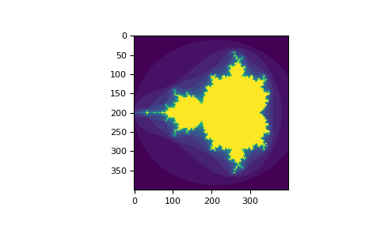
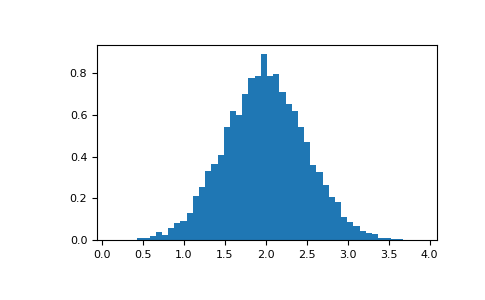
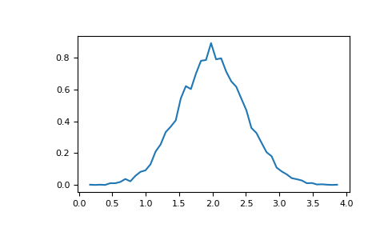

<!--more-->

# [Numpy](https://docs.scipy.org/doc/numpy/reference/routines.html#routines)
> https://docs.scipy.org/doc/numpy/reference/generated/

## The Basics

### **ndarray** 는 Numpy의 배열 클래스이다.

* ndarray.ndim
* ndarray.shape
* ndarray.size
* ndarray.dtype
* ndarray.itemsize
* ndarray.data

```python
>>> import numpy as np
>>> a = np.arange(15).reshape(3, 5)
>>> a
array([[ 0,  1,  2,  3,  4],
       [ 5,  6,  7,  8,  9],
       [10, 11, 12, 13, 14]])
```
```python
>>> a.shape
(3, 5)
```
```python
>>> a.ndim
2
```
```python
>>> a.dtype.name
'int64'
```
```python
>>> a.itemsize
8
```
```python
>>> a.size
15
```
```python
>>> type(a)
<type 'numpy.ndarray'>
```
```python
>>> b = np.array([6, 7, 8])
>>> b
array([6, 7, 8])
>>> type(b)
<type 'numpy.ndarray'></type>
```

### Array Creation

* 다양한 방법이 있다
* 입력한 데이터의 유형에 따라 dtype이 달라진다.
* 
```python
>>> import numpy as np
>>> a = np.array([2, 3, 4])
>>> a = np.array(2, 3, 4)       # ERROR
```
```python 
>>> b = np.array([1.2, 3.5, 5.1])
>>> a.dtype
dtype('int64')
>>> b.dtype
dtype('float64')
```

```python
>>> b = np.array([(1.5, 2, 3), (4, 5, 6)])
>>> b
array([[ 1.5,  2. ,  3. ],
       [ 4. ,  5. ,  6. ]])
```
배열 생성 시 dtype을 명시적으로 정할 수 있다.
```python
>>> c = np.array( [ [1,2], [3,4] ], dtype=complex )
>>> c
array([[ 1.+0.j,  2.+0.j],
       [ 3.+0.j,  4.+0.j]])
```

* np.zeros()
* np.ones()
* np.empty()

기본 데이터 타입은 `float64` 이다.
```python
>>> np.zeros( (3,4) )
array([[ 0.,  0.,  0.,  0.],
       [ 0.,  0.,  0.,  0.],
       [ 0.,  0.,  0.,  0.]])
>>> np.ones( (2,3,4), dtype=np.int16 )                # dtype can also be specified
array([[[ 1, 1, 1, 1],
        [ 1, 1, 1, 1],
        [ 1, 1, 1, 1]],
       [[ 1, 1, 1, 1],
        [ 1, 1, 1, 1],
        [ 1, 1, 1, 1]]], dtype=int16)
>>> np.empty( (2,3) )                                 # uninitialized, output may vary
array([[  3.73603959e-262,   6.02658058e-154,   6.55490914e-260],
       [  5.30498948e-313,   3.14673309e-307,   1.00000000e+000]])
```

* np.arange() : 리스트가 아닌 배열을 반환한다.
```python
>>> np.arange( 10, 30, 5 )
array([10, 15, 20, 25])
>>> np.arange( 0, 2, 0.3 )                 # it accepts float arguments
array([ 0. ,  0.3,  0.6,  0.9,  1.2,  1.5,  1.8])
```

* np.linspace() : np.arange()는 부동소수점을 사용하기 때문에 정확한 값을 예측하기 어렵다.
```python
>>> from numpy import pi
>>> np.linspace( 0, 2, 9 )                 # 9 numbers from 0 to 2
array([ 0.  ,  0.25,  0.5 ,  0.75,  1.  ,  1.25,  1.5 ,  1.75,  2.  ])
>>> x = np.linspace( 0, 2*pi, 100 )        # useful to evaluate function at lots of points
>>> f = np.sin(x)
```


### Pringting Arrays

* 1차원, 2차원, 3차원 배열의 출력
```python
>>> a = np.arange(6)                         # 1d array
>>> print(a)
[0 1 2 3 4 5]
>>>
>>> b = np.arange(12).reshape(4,3)           # 2d array
>>> print(b)
[[ 0  1  2]
 [ 3  4  5]
 [ 6  7  8]
 [ 9 10 11]]
>>>
>>> c = np.arange(24).reshape(2,3,4)         # 3d array
>>> print(c)
[[[ 0  1  2  3]
  [ 4  5  6  7]
  [ 8  9 10 11]]
 [[12 13 14 15]
  [16 17 18 19]
  [20 21 22 23]]]
```

* 큰 배열을 강제로 모두 출력하는 설정
```python
>>> np.set_printoptions(threshold=np.nan) 
```

### Basic Operations
```python
>>> a = np.array( [20,30,40,50] )
>>> b = np.arange( 4 )
>>> b
array([0, 1, 2, 3])
>>> c = a-b
>>> c
array([20, 29, 38, 47])
>>> b**2
array([0, 1, 4, 9])
>>> 10*np.sin(a)
array([ 9.12945251, -9.88031624,  7.4511316 , -2.62374854])
>>> a<35
array([ True, True, False, False])
```

* 행렬의 크기가 같은 배열끼리의 연산이 가능하다.
```python
>>> A = np.array( [[1,1],
...             [0,1]] )
>>> B = np.array( [[2,0],
...             [3,4]] )
>>> A * B                       # elementwise product
array([[2, 0],
       [0, 4]])
>>> A @ B                       # matrix product
array([[5, 4],
       [3, 4]])
>>> A.dot(B)                    # another matrix product
array([[5, 4],
       [3, 4]])
```

* `+=`, `*=` 로 기존 배열의 수정이 가능하다.
```python
>>> a = np.ones((2,3), dtype=int)
>>> b = np.random.random((2,3))
>>> a *= 3
>>> a
array([[3, 3, 3],
       [3, 3, 3]])
>>> b += a
>>> b
array([[ 3.417022  ,  3.72032449,  3.00011437],
       [ 3.30233257,  3.14675589,  3.09233859]])
>>> a += b                  # b is not automatically converted to integer type
Traceback (most recent call last):
  ...
TypeError: Cannot cast ufunc add output from dtype('float64') to dtype('int64') with casting rule 'same_kind'
```

* 데이터 타입이 다를 경우 더 일반적이거나 정확한 배열(up casting)을 따른다.
```python
>>> a = np.ones(3, dtype=np.int32)
>>> b = np.linspace(0,pi,3)
>>> b.dtype.name
'float64'
>>> c = a+b
>>> c
array([ 1.        ,  2.57079633,  4.14159265])
>>> c.dtype.name
'float64'
>>> d = np.exp(c*1j)
>>> d
array([ 0.54030231+0.84147098j, -0.84147098+0.54030231j,
       -0.54030231-0.84147098j])
>>> d.dtype.name
'complex128'
```

```python
>>> a = np.random.random((2,3))
>>> a
array([[ 0.18626021,  0.34556073,  0.39676747],
       [ 0.53881673,  0.41919451,  0.6852195 ]])
>>> a.sum()
2.5718191614547998
>>> a.min()
0.1862602113776709
>>> a.max()
0.6852195003967595
```

* axis를 활용하면 다양한 배열 가공이 가능하다.
```python
>>> b = np.arange(12).reshape(3,4)
>>> b
array([[ 0,  1,  2,  3],
       [ 4,  5,  6,  7],
       [ 8,  9, 10, 11]])
>>>
>>> b.sum(axis=0)                            # sum of each column
array([12, 15, 18, 21])
>>>
>>> b.min(axis=1)                            # min of each row
array([0, 4, 8])
>>>
>>> b.cumsum(axis=1)                         # cumulative sum along each row
array([[ 0,  1,  3,  6],
       [ 4,  9, 15, 22],
       [ 8, 17, 27, 38]])
```

### Universal Functions

* 몇 가지 수학적 기능 (범용 함수)를 제공한다.
    * `all`, `any`, `apply_along_axis`, `argmax`, `argmin`, `argsort`, `average`, `bincount`, `ceil`, `clip`, `conj`, `corrcoef`, `cov`, `cross`, `cumprod`, `cumsum`, `diff`, `dot`, `floor`, `inner`, `inv`, `lexsort`, `max`, `maximum`, `mean`, `median`, `min`, `minimum`, `nonzero`, `outer`, `prod`, `re`, `round`, `sort`, `std`, `sum`, `trace`, `transpose`, `var`, `vdot`, `vectorize`, `where`
```python
>>> B = np.arange(3)
>>> B
array([0, 1, 2])
>>> np.exp(B)
array([ 1.        ,  2.71828183,  7.3890561 ])
>>> np.sqrt(B)
array([ 0.        ,  1.        ,  1.41421356])
>>> C = np.array([2., -1., 4.])
>>> np.add(B, C)
array([ 2.,  0.,  6.])
```

### Indexing, Slicing and Iterating

* 1차원 배열
```python
>>> a = np.arange(10)**3
>>> a
array([  0,   1,   8,  27,  64, 125, 216, 343, 512, 729])
>>> a[2]
8
>>> a[2:5]
array([ 8, 27, 64])
>>> a[:6:2] = -1000    # equivalent to a[0:6:2] = -1000; from start to position 6, exclusive, set every 2nd element to -1000
>>> a
array([-1000,     1, -1000,    27, -1000,   125,   216,   343,   512,   729])
>>> a[ : :-1]                                 # reversed a
array([  729,   512,   343,   216,   125, -1000,    27, -1000,     1, -1000])
>>> for i in a:
...     print(i**(1/3.))
...
nan
1.0
nan
3.0
nan
5.0
6.0
7.0
8.0
9.0
```

* 다차원 배열
```python
>>> def f(x,y):
...     return 10*x+y
...
>>> b = np.fromfunction(f,(5,4),dtype=int)
>>> b
array([[ 0,  1,  2,  3],
       [10, 11, 12, 13],
       [20, 21, 22, 23],
       [30, 31, 32, 33],
       [40, 41, 42, 43]])
>>> b[2,3]
23
>>> b[0:5, 1]                       # each row in the second column of b
array([ 1, 11, 21, 31, 41])
>>> b[ : ,1]                        # equivalent to the previous example
array([ 1, 11, 21, 31, 41])
>>> b[1:3, : ]                      # each column in the second and third row of b
array([[10, 11, 12, 13],
       [20, 21, 22, 23]])
>>> b[-1]                                  # the last row. Equivalent to b[-1,:]
array([40, 41, 42, 43])
```

* `.`으로 다차원 배열의 인덱스를 대체할 수 있다
```python
>>> c = np.array( [[[  0,  1,  2],               # a 3D array (two stacked 2D arrays)
...                 [ 10, 12, 13]],
...                [[100,101,102],
...                 [110,112,113]]])
>>> c.shape
(2, 2, 3)
>>> c[1,...]                                   # same as c[1,:,:] or c[1]
array([[100, 101, 102],
       [110, 112, 113]])
>>> c[...,2]                                   # same as c[:,:,2]
array([[  2,  13],
       [102, 113]])
```

* 기본 for 문은 첫 번째 축에 대해서 작동한다.
* `flat`을 사용하면 각 요소에 접근이 가능하다.
* `Indexing`, `Indexing` (reference), `newaxis`, `ndenumerate`, `indices`
```python
>>> for row in b:
...     print(row)
...
[0 1 2 3]
[10 11 12 13]
[20 21 22 23]
[30 31 32 33]
[40 41 42 43]
>>> for element in b.flat:
...     print(element)
...
0
1
2
3
10
11
12
13
20
21
22
23
30
31
32
33
40
41
42
43
```

## Shape Manipulation

### Changing the shape of an array

* 배열을 `shape`은 변경 가능하다.
```python
>>> a = np.floor(10*np.random.random((3,4)))
>>> a
array([[ 2.,  8.,  0.,  6.],
       [ 4.,  5.,  1.,  1.],
       [ 8.,  9.,  3.,  6.]])
>>> a.shape
(3, 4)
>>> a.ravel()  # returns the array, flattened
array([ 2.,  8.,  0.,  6.,  4.,  5.,  1.,  1.,  8.,  9.,  3.,  6.])
>>> a.reshape(6,2)  # returns the array with a modified shape
array([[ 2.,  8.],
       [ 0.,  6.],
       [ 4.,  5.],
       [ 1.,  1.],
       [ 8.,  9.],
       [ 3.,  6.]])
>>> a.T  # returns the array, transposed
array([[ 2.,  4.,  8.],
       [ 8.,  5.,  9.],
       [ 0.,  1.,  3.],
       [ 6.,  1.,  6.]])
>>> a.T.shape
(4, 3)
```

* `reshape`은 수정된 형태로 배열을 반환
* `resize`는 배열 자체를 수정
```python
>>> a
array([[ 2.,  8.,  0.,  6.],
       [ 4.,  5.,  1.,  1.],
       [ 8.,  9.,  3.,  6.]])
>>> a.resize((2,6))
>>> a
array([[ 2.,  8.,  0.,  6.,  4.,  5.],
       [ 1.,  1.,  8.,  9.,  3.,  6.]])
```

* -1을 사용하면 나머지 값을 자동을 계산한다.
```python
>>> a.reshape(3,-1)
array([[ 2.,  8.,  0.,  6.],
       [ 4.,  5.,  1.,  1.],
       [ 8.,  9.,  3.,  6.]])
```

### Stacking together different arrays

* `vstack` 과 `hstack`으로 서로 다른 배열을 합칠 수 있다.
```python
>>> a = np.floor(10*np.random.random((2,2)))
>>> a
array([[ 8.,  8.],
       [ 0.,  0.]])
>>> b = np.floor(10*np.random.random((2,2)))
>>> b
array([[ 1.,  8.],
       [ 0.,  4.]])
>>> np.vstack((a,b))
array([[ 8.,  8.],
       [ 0.,  0.],
       [ 1.,  8.],
       [ 0.,  4.]])
>>> np.hstack((a,b))
array([[ 8.,  8.,  1.,  8.],
       [ 0.,  0.,  0.,  4.]])
```

* `column_stack`은 1차원 배열들을 2차원 배열로 반환한다.
* 2차원 배열의 경우 `hstack`과 동일한 기능을 수행한다.
* `row_stack`은 `vstack`과 동일한 기능을 수행한다.
```python
>>> from numpy import newaxis
>>> np.column_stack((a,b))     # with 2D arrays
array([[ 8.,  8.,  1.,  8.],
       [ 0.,  0.,  0.,  4.]])
>>> a = np.array([4.,2.])
>>> b = np.array([3.,8.])
>>> np.column_stack((a,b))     # returns a 2D array
array([[ 4., 3.],
       [ 2., 8.]])
>>> np.hstack((a,b))           # the result is different
array([ 4., 2., 3., 8.])
>>> a[:,newaxis]               # this allows to have a 2D columns vector
array([[ 4.],
       [ 2.]])
>>> np.column_stack((a[:,newaxis],b[:,newaxis]))
array([[ 4.,  3.],
       [ 2.,  8.]])
>>> np.hstack((a[:,newaxis],b[:,newaxis]))   # the result is the same
array([[ 4.,  3.],
       [ 2.,  8.]])
```

* `r_`과 `c_`를 이용해 배열을 만들 수 있다.
```python
>>> np.r_[1:4,0,4]
array([1, 2, 3, 0, 4])
```

### Splitting one array into several smaller ones

* 배열 분리가 가능하다.
```python
>>> a = np.floor(10*np.random.random((2,12)))
>>> a
array([[ 9.,  5.,  6.,  3.,  6.,  8.,  0.,  7.,  9.,  7.,  2.,  7.],
       [ 1.,  4.,  9.,  2.,  2.,  1.,  0.,  6.,  2.,  2.,  4.,  0.]])
>>> np.hsplit(a,3)   # Split a into 3
[array([[ 9.,  5.,  6.,  3.],
       [ 1.,  4.,  9.,  2.]]), array([[ 6.,  8.,  0.,  7.],
       [ 2.,  1.,  0.,  6.]]), array([[ 9.,  7.,  2.,  7.],
       [ 2.,  2.,  4.,  0.]])]
>>> np.hsplit(a,(3,4))   # Split a after the third and the fourth column
[array([[ 9.,  5.,  6.],
       [ 1.,  4.,  9.]]), array([[ 3.],
       [ 2.]]), array([[ 6.,  8.,  0.,  7.,  9.,  7.,  2.,  7.],
       [ 2.,  1.,  0.,  6.,  2.,  2.,  4.,  0.]])]
```

## Copies and Views

### No Copy at All

* a 와 b는 같은 배열을 가리키고 있다.
```python
>>> a = np.arange(12)
>>> b = a            # no new object is created
>>> b is a           # a and b are two names for the same ndarray object
True
>>> b.shape = 3,4    # changes the shape of a
>>> a.shape
(3, 4)
```

### View or Shallow Copy
* `view`는 새로운 배열을 만들지만 값은 공유하고 있다.
```python
>>> c = a.view()
>>> c is a
False
>>> c.base is a                        # c is a view of the data owned by a
True
>>> c.flags.owndata
False
>>>
>>> c.shape = 2,6                      # a's shape doesn't change
>>> a.shape
(3, 4)
>>> c[0,4] = 1234                      # a's data changes
>>> a
array([[   0,    1,    2,    3],
       [1234,    5,    6,    7],
       [   8,    9,   10,   11]])
```

* 배열을 slicing 한 경우 해당 배열의 `view`를 반환하기 때문에 데이터 변경 시 원본 데이터도 변경된다.
```python
>>> s = a[ : , 1:3]     # spaces added for clarity; could also be written "s = a[:,1:3]"
>>> s[:] = 10           # s[:] is a view of s. Note the difference between s=10 and s[:]=10
>>> a
array([[   0,   10,   10,    3],
       [1234,   10,   10,    7],
       [   8,   10,   10,   11]])
```

### Deep Copy

* `copy`는 완전한 복사본을 만들며 원본 데이터를 가리키지 않는다.
```python
>>> d = a.copy()                          # a new array object with new data is created
>>> d is a
False
>>> d.base is a                           # d doesn't share anything with a
False
>>> d[0,0] = 9999
>>> a
array([[   0,   10,   10,    3],
       [1234,   10,   10,    7],
       [   8,   10,   10,   11]])
```

* 원본 배열이 더 이상 필요하지 않는 경우 잘라낸 후 `copy`로 복사본을 만든다.
* `b = a[:100]`를 사용하는 경우 원본 데이터를 삭제하더라도 `b.base`가 원본 데이터를 참조하고 있다.
```python
>>> a = np.arange(int(1e8))
>>> b = a[:100].copy()
>>> del a  # the memory of ``a`` can be released.
```

## Less Basic

### [Broadcasting rules](https://docs.scipy.org/doc/numpy/user/basics.broadcasting.html)

## Fancy indexing and index tricks

### Indexing with Arrays of Indices
```python
>>> a = np.arange(12)**2                       # the first 12 square numbers
>>> i = np.array( [ 1,1,3,8,5 ] )              # an array of indices
>>> a[i]                                       # the elements of a at the positions i
array([ 1,  1,  9, 64, 25])
>>>
>>> j = np.array( [ [ 3, 4], [ 9, 7 ] ] )      # a bidimensional array of indices
>>> a[j]                                       # the same shape as j
array([[ 9, 16],
       [81, 49]])
```

* 다차원 배열의 경우 1차원 인덱스 배열은 첫 번째 차원을 가리킨다.
```python
>>> palette = np.array( [ [0,0,0],                # black
...                       [255,0,0],              # red
...                       [0,255,0],              # green
...                       [0,0,255],              # blue
...                       [255,255,255] ] )       # white
>>> image = np.array( [ [ 0, 1, 2, 0 ],           # each value corresponds to a color in the palette
...                     [ 0, 3, 4, 0 ]  ] )
>>> palette[image]                            # the (2,4,3) color image
array([[[  0,   0,   0],
        [255,   0,   0],
        [  0, 255,   0],
        [  0,   0,   0]],
       [[  0,   0,   0],
        [  0,   0, 255],
        [255, 255, 255],
        [  0,   0,   0]]])
```

* 배열의 크기가 같으면 다차원에 대한 인덱스 배열을 사용할 수 있다.
```python
>>> a = np.arange(12).reshape(3,4)
>>> a
array([[ 0,  1,  2,  3],
       [ 4,  5,  6,  7],
       [ 8,  9, 10, 11]])
>>> i = np.array( [ [0,1],                        # indices for the first dim of a
...                 [1,2] ] )
>>> j = np.array( [ [2,1],                        # indices for the second dim
...                 [3,3] ] )
>>>
>>> a[i,j]                                     # i and j must have equal shape
array([[ 2,  5],
       [ 7, 11]])
>>>
>>> a[i,2]
array([[ 2,  6],
       [ 6, 10]])
>>>
>>> a[:,j]                                     # i.e., a[ : , j]
array([[[ 2,  1],
        [ 3,  3]],
       [[ 6,  5],
        [ 7,  7]],
       [[10,  9],
        [11, 11]]])
>>> l = [i,j]
>>> a[l]                                       # equivalent to a[i,j]
array([[ 2,  5],
       [ 7, 11]])
```

* `np.array([i, j])`를 사용할 수 없다.
```python
>>> s = np.array( [i,j] )
>>> a[s]                                       # not what we want
Traceback (most recent call last):
  File "<stdin>", line 1, in ?
IndexError: index (3) out of range (0<=index<=2) in dimension 0
>>>
>>> a[tuple(s)]                                # same as a[i,j]
array([[ 2,  5],
       [ 7, 11]])
```

* 인덱스 배열로 각 축의 최대값을 구할 수 있다.
```python
>>> time = np.linspace(20, 145, 5)                 # time scale
>>> data = np.sin(np.arange(20)).reshape(5,4)      # 4 time-dependent series
>>> time
array([  20.  ,   51.25,   82.5 ,  113.75,  145.  ])
>>> data
array([[ 0.        ,  0.84147098,  0.90929743,  0.14112001],
       [-0.7568025 , -0.95892427, -0.2794155 ,  0.6569866 ],
       [ 0.98935825,  0.41211849, -0.54402111, -0.99999021],
       [-0.53657292,  0.42016704,  0.99060736,  0.65028784],
       [-0.28790332, -0.96139749, -0.75098725,  0.14987721]])
>>>
>>> ind = data.argmax(axis=0)                  # index of the maxima for each series
>>> ind
array([2, 0, 3, 1])
>>>
>>> time_max = time[ind]                       # times corresponding to the maxima
>>>
>>> data_max = data[ind, range(data.shape[1])] # => data[ind[0],0], data[ind[1],1]...
>>>
>>> time_max
array([  82.5 ,   20.  ,  113.75,   51.25])
>>> data_max
array([ 0.98935825,  0.84147098,  0.99060736,  0.6569866 ])
>>>
>>> np.all(data_max == data.max(axis=0))
True
```

* 값을 할당하고자 하는 대상으로 인덱스 배열을 사용할 수 있다.
```python
>>> a = np.arange(5)
>>> a
array([0, 1, 2, 3, 4])
>>> a[[1,3,4]] = 0
>>> a
array([0, 0, 2, 0, 0])
```

* 같은 곳에 여러 번 할당할 경우 마지막 값만 적용된다.
```python
>>> a = np.arange(5)
>>> a[[0,0,2]]=[1,2,3]
>>> a
array([2, 1, 3, 3, 4])
>>> a[[0,0,2]]+=1       # 한번만 수행
>>> a
array([3, 1, 4, 3, 4])
```

### Indexing with Boolean Arrays

* 배열과 같은 크기의 Boolean 배열을 생성할 수 있다.
```python
>>> a = np.arange(12).reshape(3,4)
>>> b = a > 4
>>> b                                          # b is a boolean with a's shape
array([[False, False, False, False],
       [False,  True,  True,  True],
       [ True,  True,  True,  True]])
>>> a[b]                                       # 1d array with the selected elements
array([ 5,  6,  7,  8,  9, 10, 11])
>>> a[b] = 0                                   # All elements of 'a' higher than 4 become 0
>>> a
array([[0, 1, 2, 3],
       [4, 0, 0, 0],
       [0, 0, 0, 0]])
```

* 다음 코드로 이미지를 생성할 수 있다.
```python
>>> import numpy as np
>>> import matplotlib.pyplot as plt
>>> def mandelbrot( h,w, maxit=20 ):
...     """Returns an image of the Mandelbrot fractal of size (h,w)."""
...     y,x = np.ogrid[ -1.4:1.4:h*1j, -2:0.8:w*1j ]
...     c = x+y*1j
...     z = c
...     divtime = maxit + np.zeros(z.shape, dtype=int)
...
...     for i in range(maxit):
...         z = z**2 + c
...         diverge = z*np.conj(z) > 2**2            # who is diverging
...         div_now = diverge & (divtime==maxit)  # who is diverging now
...         divtime[div_now] = i                  # note when
...         z[diverge] = 2                        # avoid diverging too much
...
...     return divtime
>>> plt.imshow(mandelbrot(400,400))
>>> plt.show()
```


* 다차원의 배열에 대해 Boolean 배열을 이용하여 원하는 부분을 선택할 수 있다.
```python
>>> a = np.arange(12).reshape(3,4)
>>> b1 = np.array([False,True,True])             # first dim selection
>>> b2 = np.array([True,False,True,False])       # second dim selection
>>>
>>> a[b1,:]                                   # selecting rows
array([[ 4,  5,  6,  7],
       [ 8,  9, 10, 11]])
>>>
>>> a[b1]                                     # same thing
array([[ 4,  5,  6,  7],
       [ 8,  9, 10, 11]])
>>>
>>> a[:,b2]                                   # selecting columns
array([[ 0,  2],
       [ 4,  6],
       [ 8, 10]])
>>>
>>> a[b1,b2]                                  # a weird thing to do
array([ 4, 10])
```

### ix_()

```python
>>> a = np.array([2,3,4,5])
>>> b = np.array([8,5,4])
>>> c = np.array([5,4,6,8,3])
>>> ax,bx,cx = np.ix_(a,b,c)
>>> ax
array([[[2]],
       [[3]],
       [[4]],
       [[5]]])
>>> bx
array([[[8],
        [5],
        [4]]])
>>> cx
array([[[5, 4, 6, 8, 3]]])
>>> ax.shape, bx.shape, cx.shape
((4, 1, 1), (1, 3, 1), (1, 1, 5))
>>> result = ax+bx*cx
>>> result
array([[[42, 34, 50, 66, 26],
        [27, 22, 32, 42, 17],
        [22, 18, 26, 34, 14]],
       [[43, 35, 51, 67, 27],
        [28, 23, 33, 43, 18],
        [23, 19, 27, 35, 15]],
       [[44, 36, 52, 68, 28],
        [29, 24, 34, 44, 19],
        [24, 20, 28, 36, 16]],
       [[45, 37, 53, 69, 29],
        [30, 25, 35, 45, 20],
        [25, 21, 29, 37, 17]]])
>>> result[3,2,4]
17
>>> a[3]+b[2]*c[4]
17
```

```python
>>> def ufunc_reduce(ufct, *vectors):
...    vs = np.ix_(*vectors)
...    r = ufct.identity
...    for v in vs:
...        r = ufct(r,v)
...    return r
>>> ufunc_reduce(np.add,a,b,c)
array([[[15, 14, 16, 18, 13],
        [12, 11, 13, 15, 10],
        [11, 10, 12, 14,  9]],
       [[16, 15, 17, 19, 14],
        [13, 12, 14, 16, 11],
        [12, 11, 13, 15, 10]],
       [[17, 16, 18, 20, 15],
        [14, 13, 15, 17, 12],
        [13, 12, 14, 16, 11]],
       [[18, 17, 19, 21, 16],
        [15, 14, 16, 18, 13],
        [14, 13, 15, 17, 12]]])
```

### [Indexing with strings](https://docs.scipy.org/doc/numpy/user/basics.rec.html#structured-arrays)


## Linear Algebra
## 선형대수학

### Simple Array Operations
```python
>>> import numpy as np
>>> a = np.array([[1.0, 2.0], [3.0, 4.0]])
>>> print(a)
[[ 1.  2.]
 [ 3.  4.]]

>>> a.transpose()
array([[ 1.,  3.],
       [ 2.,  4.]])

>>> np.linalg.inv(a)
array([[-2. ,  1. ],
       [ 1.5, -0.5]])

>>> u = np.eye(2) # unit 2x2 matrix; "eye" represents "I"
>>> u
array([[ 1.,  0.],
       [ 0.,  1.]])
>>> j = np.array([[0.0, -1.0], [1.0, 0.0]])

>>> j @ j        # matrix product
array([[-1.,  0.],
       [ 0., -1.]])

>>> np.trace(u)  # trace
2.0

>>> y = np.array([[5.], [7.]])
>>> np.linalg.solve(a, y)
array([[-3.],
       [ 4.]])

>>> np.linalg.eig(j)
(array([ 0.+1.j,  0.-1.j]), array([[ 0.70710678+0.j        ,  0.70710678-0.j        ],
       [ 0.00000000-0.70710678j,  0.00000000+0.70710678j]]))
```

## Tricks and Tips

### "Automatic" Reshaping
```python
>>> a = np.arange(30)
>>> a.shape = 2,-1,3  # -1 means "whatever is needed"
>>> a.shape
(2, 5, 3)
>>> a
array([[[ 0,  1,  2],
        [ 3,  4,  5],
        [ 6,  7,  8],
        [ 9, 10, 11],
        [12, 13, 14]],
       [[15, 16, 17],
        [18, 19, 20],
        [21, 22, 23],
        [24, 25, 26],
        [27, 28, 29]]])
```

### Vector Stacking

```python
x = np.arange(0,10,2)                     # x=([0,2,4,6,8])
y = np.arange(5)                          # y=([0,1,2,3,4])
m = np.vstack([x,y])                      # m=([[0,2,4,6,8],
                                          #     [0,1,2,3,4]])
xy = np.hstack([x,y])                     # xy =([0,2,4,6,8,0,1,2,3,4])
```

### Histograms
```python
>>> import numpy as np
>>> import matplotlib.pyplot as plt
>>> # Build a vector of 10000 normal deviates with variance 0.5^2 and mean 2
>>> mu, sigma = 2, 0.5
>>> v = np.random.normal(mu,sigma,10000)
>>> # Plot a normalized histogram with 50 bins
>>> plt.hist(v, bins=50, density=1)       # matplotlib version (plot)
>>> plt.show()
```

```python
>>> # Compute the histogram with numpy and then plot it
>>> (n, bins) = np.histogram(v, bins=50, density=True)  # NumPy version (no plot)
>>> plt.plot(.5*(bins[1:]+bins[:-1]), n)
>>> plt.show()
```


