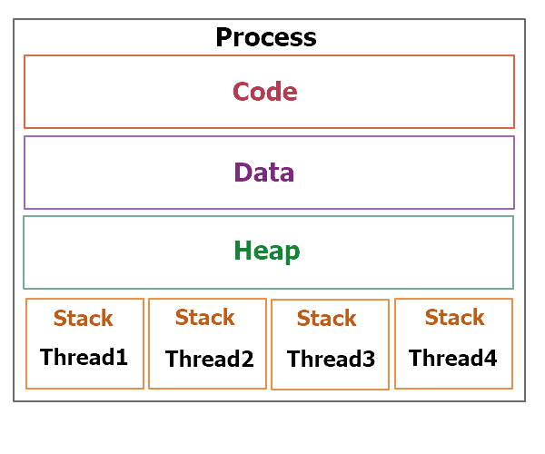

<!--more-->

## Obejct Oriented Programming

### Class
객체의 틀.   
Class를 실체화 한 것이 `객체`.   
객체를 실체화 한 것이 `인스턴스`.    

### JAVA의 4가지 특징

#### 1. 추상화 Abstraction
객체들의 공통적인 특징을 추출하는 것
- 추상클래스
  - `공통적인 기능`을 하는 객체들의 추상화
  - 구현 메소드가 있어도 되며 `추상 메소드`는 구현해서 사용 가능
  - `extends(확장)`로 상속받고 다중상속이 불가능

- 인터페이스
  - 특정 메소드를 `강제`하는 클래스
  - 구현체 없이 메소드에 대한 명세만 주어지고 자식 클래스에서 `반드시` 구현
  - `implements(구현)`로 상속받고 다중상속이 가능

#### 2. 캡슐화 Encapsulation
높은 `응집도`와 낮은 `결합도`는 요구사항 변경 시 유연하게 대처할 수 있음

- 접근 지정자

| |private|default|protected|public|
|:---:|:----:|:----:|:----:|:----:|
|클래스 내부|O|O|O|O|
|해당 패키지|X|O|O|O|
|상속 관계|X|X|O|O|
|다른 패키지|X|X|X|O|

- 그 외
  - **static**   
    - 변수, 메소드, 내부클래스 (외부클래스 X)   
    - 클래스의 변수
    - static 메소드는 static 변수만 가져다 쓸 수 있음 (외부에 있는 변수 중)  
  - **final**
    - 클래스 : 상속불가 (String X)
    - 메소드 : Override X
    - 변수 : 상수
  - **abstract**
    - 추상 메소드를 적어도 한 개 가지고 있는 클래스
    - 구현된 메소드가 존재할 수 있음
    - |abstract|interface|   
      |:---:|:---:|   
      |기능을 확장시키는 목적|같은 동작을 보장(강제)하기 위한 목적|   


#### 3. 일반화 Generalization (상속성)
- 일반화 (Bottom-up) : 여러 개념에서 공통된 개념을 찾아 `일반화`하여 묶는 것
- 상속성 (Top-down): 부모클래스의 속성, 메소드를 자식클래스에 `물려주는 것`
  - **is a** 관계   


``` java
Class cup<T> {}
cup<water> watercup = new cup<water>();
cup<milk> watercup = new cup<milk>();
cup<soju> watercup = new cup<soju>();
```


#### 4. 다형성 Polymorphism
- Casting


``` java
class animal{

}
class cat extends animal {

}
public static void main(String[] args){
    animal a = new cat();
//  cat c = new animal();    자식은 부모로 캐스팅할 수 없습니다.
}
```  
- Override
  - 부모 클래스의 메소드를 자식클래스에서 `재정의`하는 것   


``` java
interface animal{
  String cry();
}
class cat implements animal{
  @Override
  String cry(){
    return "nyang";
  }
}
```

- Overload
  - 매개변수의 타입과 개수가 다르면 같은 이름의 메소드를 사용할 수 있음    
  - 매개변수의 타입과 개수가 같을 경우에는 리턴타입은 하나만 존재할 수 있음


```java
int sum(int a, int b){
  return a + b;
}
int sum(int a, int b, int c){
  return a + b + c;
}
```

------

## 컴파일 언어
`기계어`로 컴파일 되는 언어 = `번역`
코드 수정 시 다시 컴파일 해야하기 때문에 오래 걸림

### JVM
java는 `자바 가상 머신` 위에서 실행되기 때문에 OS에 독립적
메모리 관리, Garbage Collection
- Interpreter
  - 한 줄 씩 수행. 느린 속도
- JIT Compiler (Just-In-Time)
  - 인터프리터로 실행하다가 전체를 컴파일하여 `네이티브 코드`로 변경
  - 캐싱하기 때문에 한 번 컴파일했으면 이후에는 빠르게 수행
- Class Loader
  - 런타임 시 class 파일을 JVM에 로딩
  - 사용하지 않는 class 삭제
- Execution Engine
  - class 파일을 실행
- Garbage Collector


### Class file
1. 프로그램 실행 시 메모리 할당 (JVM이 관리)
2. javac가 java 파일을 class 파일로 번역
3. JVM에 로딩 후 class 파일 해석 (JIT)

------

## JAVA 자료구조

### Collection

> Set : 순서없이 데이터의 중복을 허용하지 않는 집합
>> HashSet : 가장 빠른 접근 속도 but 순서 X
>> TreeSet : 정렬 방법 지정 가능

> List : 순서가 있는 데이터의 집합. 중복 허용
>> LinkedList : 데이터의 삽입, 삭제에 유리 (Stack, Queue)
>> Vector : 내부에서 자동 동기화처리
>> ArrayList : 데이터 조회에 유리

> Queue
>> LinkedList
>> PriorityQueue

> Map : key & value 쌍으로 이루어진 데이터의 집합. 순서가 없고 key 중복을 허용하지 않음
>> Hashtable : null 불가. HashMap 보다는 느리지만 동기화 지원.
>> HashMap : null 가능
>> TreeMap : 정렬하여 저장하기 때문에 검색에 유리


------

## Exception

### 예외의 종류
> java.lang.Object
>> java.lang.Throwable
>>> java.lang.Exception
>>> - RuntimeException
>>>   - IndexOutOfBoundsException
>>>   - NullPointerException
>>>   - NumberFormatException
>>>   - ArithmeticException
>>> - IOException
>>>   - FileNotFoundException


### 예외 처리
``` java
try {
  // 예외가 발생할지도 모르는 코드
} catch (Exception e){
  // 예외 발생 시 처리 코드
} finally {
  // 예외 발생에 상관없이 반드시 실행되어야 하는 코드
  // ex. file close
}
```

------

## Thread
### Process vs Thread


### Multi Thread
```java
class Thread1 extends Thread{
  @Override
  public void run(){
    System.out.println("Thread1");
  }
}
class Thread2 extends Thread{
  @Override
  public void run(){
    System.out.println("Thread2");
  }
}
public static void main(String[] args){
  Thread1 t1 = new Thread1();
  Thread2 t2 = new Thread2();
  t1.start();
  t2.start();
}
```
