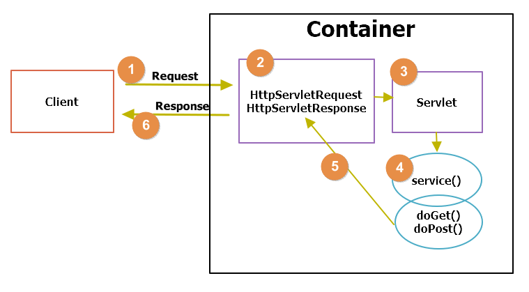
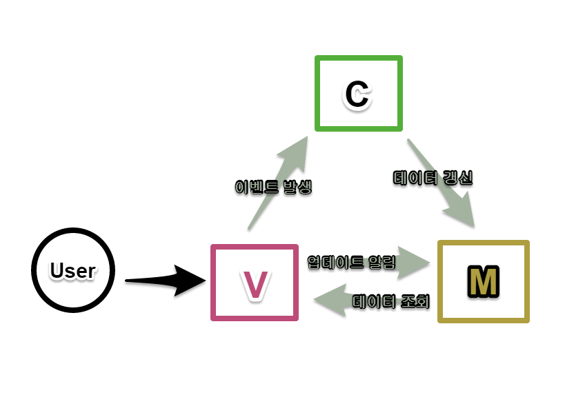

<!--more-->

## Web Application


> 로컬에서 독립적으로 수행되는 것이 아니라
> 반드시 웹 브러우저 상에서 HTTP 프로토콜 및 HTML 문서를 근간으로 수행되는 애플리케이션
> 인터넷이나 인트라넷을 통해 웹 브라우저에서 이용할 수 있는 소프트웨어

### 웹 브라우저
클라이언트. 사용자가 접속하는 곳  
사용자의 요청을 웹 서버로 전달

#### 웹 서버
HTTP 프로토콜 기반  
클라이언트 요청을 처리하는 곳  
HTML, 이미지, CSS, JavaScript를 웹 브라우저에 제공  
정적인 컨텐츠를 제공


#### 웹 애플리케이션 서버 (WAS)
페이지의 로직 수행 및 데이터베이스 연동  
웹 서버 / 컨테이너 (동적인 컨텐츠)
ex) Apache Tomcat

#### 데이터베이스
웹에서 발생한 데이터를 저장

| |ASP|JSP|PHP
|:---:|:---:|:---:|:---:|
|속도|중간|느림|빠름
|이식성|낮음|높음|중간
장점|COM 객체|객체지향  유지보수 용이|빠른 속도  가볍고 용이


## Servlet (Server Side Applet)
`html`코드가 들어간 `java` 코드


### Servlet 동작 방식


1. 클라이언트가 요청한 `HTTP Request`를 `Servlet Container`로 전송
2. Servlet Container에서 `HttpServletRequest`, `HttpServletResponse` 두 객체를 생성
3. `web.xml`에서 사용자가 요청한 URL을 분석해 각 서블릿을 찾음
4. 해당 서블릿에서 `service` 메소드를 호출한 후 `deGet()` / `doPost()`를 호출
5. `deGet()` / `doPost()`는 동적 페이지 생성 후 `HttpServletResponse`객에체 응답 전송
6. `HttpServletRequest`, `HttpServletResponse` 객체 소멸   


**HelloServlet.java**
``` java
// 사용자의 request와 Servlet를 매핑
@WebServlet("/hello.do")
public class HelloServlet extends HttpServlet {
  private static final long serialVersionUID = 1L;

  @Override // 초기화. 한 번만 일어남
  public void init() throws ServletException {
    super.init();
  }

  @Override
  public void service(ServletRequest request, HttpServletResponse response) throws ServletException{
    // do Service
  }

  @Override // Get 방식
  protected void doGet(HttpServletRequest request, HttpServletResponse response) throws ServletException {
    request.setCharacterEncoding("utf-8");
    String name = request.getParameter("name");

    response.setContentType("text/html; charset=utf-8");
    PrintWriter out = response.getWriter();

    // logic

    // html 코드!!!!!!
    out.println(
				"<!DOCTYPE html>\r\n"
				+ "<html>\r\n"
				+ "<head>\r\n"
				+ "<meta charset=\"uft-8\">\r\n"
				+ "<title>Insert title here</title>\r\n"
				+ "</head>\r\n"
				+ "<body>\r\n"
				+ "	<h1>Hello " + name + "</h1>\r\n"
				+ "</body>\r\n"
				+ "</html>");
    out.close();

    response.sendRedirect("result.html");

  }

  @Override // Post 방식
  protected void doPost(HttpServletRequest request, HttpServletResponse response)
    throws ServletException {
		doGet(request, response);
  }
}

```

### Forward vs Include vs Redirect

  1. Forward    
    : `request`객체를 다른 servlet에 `전달`하고 다른 servlet이 응답
  2. Include  
    : `request`객체를 다른 servlet에 `전달`하고 원래의 servlet이 `최종 응답`
  3. Redirect
    : 요청에 따른 응답 `URL`을 클라이언트에게 전달하고 클라이언트는 다시 `요청`

### 서블릿 설정

####  `ServletConfig`

* 서블릿이 초기화 시 환경 정보를 서블릿으로 전달할 때 사용하는 객체
* 서블릿 당 하나의 ServletConfig 객체가 생성
* 초기파라미터 정보를 가져올 수 있게 해주는 메소드 제공
```java
String id = null;
public void init(){
  ServletConfig conf = getServletConfig();
  id = conf.getInitParameter("id");
}
```

`web.xml`
``` xml
<servlet>
  <servlet-name>HelloServlet</servlet-name>
  <servlet-class>com.ssafy</servlet-class>
  <init-param>
    <param-name>id</param-name>
    <param-value>ming</param-value>
  </init-param>
</servlet>

<servlet-mapping>
  <servlet-name>HelloServlet</servlet-name>
  <url-pattern>/hello</url-pattern>
</servlet-mapping>
```


### ServletContext

#### `ServletContext`
* 웹 애플리케이션내의 서블릿/JSP의 자원 공유를 위한 객체
* 웹 애플리케이션 당 하나의 ServletContext 객체가 생성
* Servlet이 실행되는 환경이나 서버 자원 관련 정보 또는 로그 파일을 기록하는 작업 관련 메소드를 제공
```java
Servletcontext context = getservletContext();
String id = context.getInitParameter("id");
InputStream is = null;
BufferedReader br = null;
try {
  is = context.getResourceAsStream(id);
  br = new BufferedReader(new InputStreamReader(is));
}
```

`web.xml`  

``` xml
<servlet>
  <servlet-name>HelloServlet</servlet-name>
  <servlet-class>com.ssafy</servlet-class>
  <init-param>
    <param-name>id</param-name>
    <param-value>ming</param-value>
  </init-param>
</servlet>

<servlet-mapping>
  <servlet-name>HelloServlet</servlet-name>
  <url-pattern>/hello</url-pattern>
</servlet-mapping>
```

## JSP (Java Server Page)
`java` 코드가 들어간 `html` 코드

* 기존 Servlet에서 html 코드 작성의 불편함
* 개발자가 작성한 JSP 파일은 `Servlet`파일로 변환됨

```HTML
<%@ page language="java" contentType="text/html; charset=UTF-8"
    pageEncoding="UTF-8"%>
<%!
	String name;
	String id;
	String msg;
%>
<%
	name = (String)request.getAttribute("name");
	id = (String)request.getAttribute("id");
	msg = (String)request.getAttribute("msg");
%>
<!DOCTYPE html>
<html>
<head>
<meta charset="UTF-8">
<title>Insert title here</title>
</head>
<body>
	<h1>Result Page</h1>
	<h1 style="color:blue;"><%=msg %></h1>
	<div><p>등록하신 이름은 <%=name %>, id는 <%=id %> 입니다.</div><br/>
	<a href="index.html">Main Page</a>
</body>
</html>
```


### JSP 태그

|스크립팅 요소|| 설명
|:---:|:---:|:---|
<%@  %> | 디렉티브 | 현재의 JSP 페이지 자체에서의 기능</br> page, include, taglib
<%!  %> | 선언 | **멤버** 변수/메소드 선언
<%   %> | 스크립트릿 | 코드 구현</br> Servlet의 service() 메소드에 구현 -> **local** 변수
<%=  %> |표현식|간단한 데이터 출력</br> 세미콜론 없음

### JSP scope
scope|기본객체|생성|소멸
:---:|:---:|:---|:---
PAGE|PAGEcONTEXT|JSP 페이지 시작|완료
REQUEST|request|웹 브라우저 요청|응답
SESSION|session|웹 브라우저|세션 타이머 만료</br> 명시적 종료 시점
APPLICATION|application|Tomcat서버 구동|종료

### JSP 액션 태그

* jsp:forward
  * 같은 웹 애플리케이션 내부에 존재하는 페이지에만 접근 가능 ( sendRedirect()와 다름 )
```HTML
<jsp:forward page = "forward/paramTo.jsp">
<jsp:param name="name" value="value" />
</jsp:forward>
```   


* jsp:include
  * 파일을 삽입하는 것이 아닌 요청 처리 흐름을 이동하는 것 ( <%@  %> 태그와 다름)
```HTML
<jsp:include page="include/sub.jsp" flush="false" />
```

### JavaBeans

**객체 클래스**
```java
public class User implements java.io.Serivalizable {
  private String id;
  private String pw;
  // 기본 생성자 필요
  public User() {}

  // getter, setter 메소드 필요
  public String getId(){
    return id;
  }
  public void setId(String id){
    this.id = id;
  }
  public String getPw(){
    return pw;
  }
  public void setPw(String pw){
    this.pw = pw;
  }
}
```

**javaBean 사용**
```HTML
<!-- 객체 생성 -->
<jsp:useBean id="user" class="ming.User" />

<jsp:setProperty name="user" property="id" value="value" />

<jsp:getProperty name="user" property="pw" />

```

## JSTL & EL

### JSTL ( Java Standard Tag Library)
* 커스텀 태그 라이브러리 모음

### EL ( Expression Language )

* page < request < session < application 순서로 해당 이름의 객체를 탐색하여 사용
* 연산도 가능

```HTML
${user.id}  
${user.pw}
```  


**core 라이브러리**

```HTML
<%@ taglib prefix="c" uri="http://java.sun.com/jsp.jstl.core" %>

<!-- 변수 -->
<c:out value="${user.id}" />
<c:set var="${user.id}" scope="request" value="ming" />
<c:remove var="${user.id}" scope="request" />

<!-- 에러 처리 -->
<c:catch var="errmsg" >
  <%= 100/0 %>
</c:catch>
<c:out value="${errmsg}" />

<!-- 조건문  -->
<c:choose>
  <c:when test="${user.id}=='ming'"> body </c:when>
  <c:otherwise> body </c:otherwise>
</c:choose>

<!-- 반복문 -->
<c:forEach begin="0" end="3" var="idx">
  <c:out value="${idx}" />
</c:forEach>

<c:forTokens items="lee:m:k" delims=":" var="token">
  <c:out value="${token}" />
</c:forTokens>
```

## Cookie :cookie:
```java
public void doPost(HttpServletRequest request, HttpServletResponse response) throws IOException {
  // Cookie 가져오기
  Cookie[] coo = request.getCookies();
  if(coo != null && coo.length > 0){
    for (int i=0; i<coo.length; i++){
      out.println(coo[i].getName() + URLDecoder.decode(coo[i].getValue()));
    }
  }

  // Cookie 생성
  Cookie cookie = new Cookie("name", URLEncoder.encode("쿠키"));
  // Cookie 유효시간 설정
  cookie.setMaxAge(365*24*3600);
  // Cookie 내보내기
  response.addCookie(Cookie);
}
```

## Session

1. 클라이언트가 특정 도메인에 요청
2. 서버는 접속한 클라이언트에 대한 세션 ID를 생성하고 값을 저장
3. 서버는 세션 ID와 함께 클라이언트에 응답
4. 클라이언트는 세션 ID를 브라우저에 쿠키로 저장 (sessionId)
5. 클라리언트가 도메인에 재요청 시 저장된 sessionId를 서버에 제출
6. 서버는 받은 sessionId로 클라이언트 구별

```java
public void doPost(HttpServletRequest request, HttpServletResponse response) throws IOException {
  // Session 생성
  HttpSession session = request.getSession(true);

  // Session이 처음 생성된 것인지 판단
  if(session.isNew()){
    // 타임아웃 시간 설정
    session.setMaxInactiveInterval(1200);
  } else {
    out.println(new Date(session.getCreationTime()));
    out.println(new Date(session.getLastAccessedTime()));
    out.println(session.getMaxInactiveInterval());
  }
}
```

## MVC
> **웹 애플리케이션 모델**
> 웹 애플리케이션을 개발할 때 일반저기으로 많은 개발자들이 사용하는 표준화된 아키텍쳐  



### Model1 vs Model2
* Model1은 jsp가 컨트롤러 역할
* Model2는 servlet이 컨트롤러 역할

## 프레임 워크
* 웹 애플리케이션의 기능과 구조를 구현하여 제공하고 있는 것
* 장점
  * 개발기간 단축
  * 견고성
  * 유지보수성 향상
* 단점
  * 프레임워크 학습
  * 프레임워크 선택
  * 유연성 부족


## MVVM
