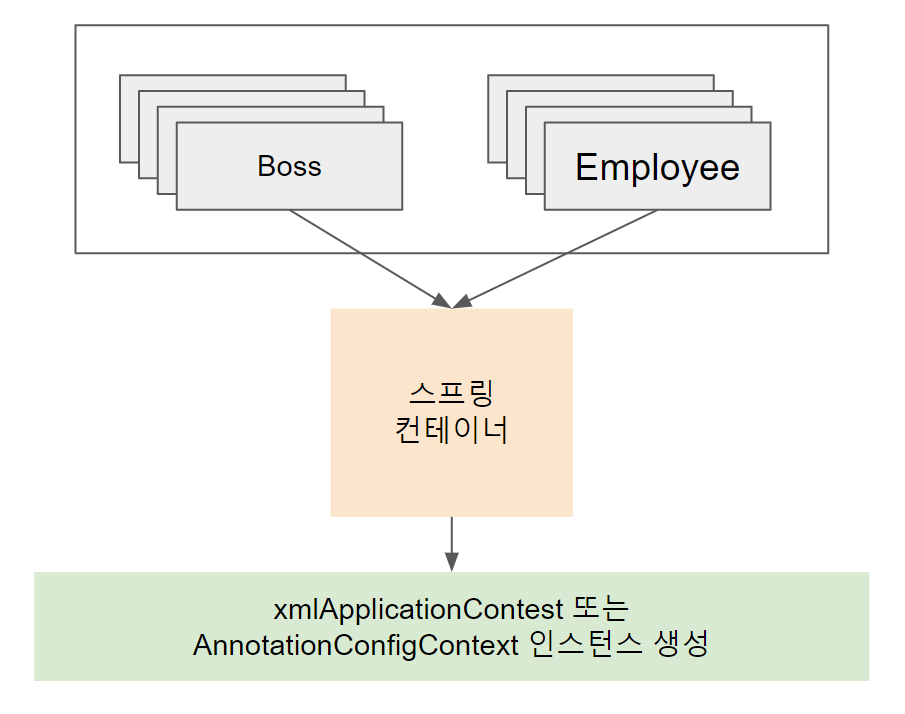
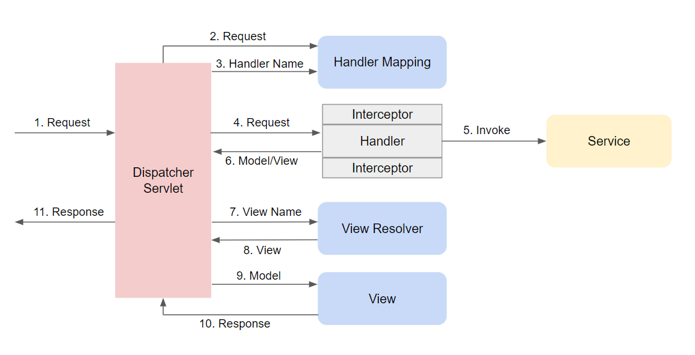

<!--more-->
## Spring 의 특징
> 자바 엔터프라이즈 개발을 편하게 해주는 오픈소스 경량급 애플리케이션 프레임워크

### IoC ( Inversion of Control )

> 프로그램의 생명주기에 대한 주도권이 **웹 애플리케이션 컨테이너** 에 있음

### Dependency Injection

>1. 하이레벨 모듈은 로우레벨 모듈에 의존해서는 안되고 모두 **인터페이스** 에 의존해야 한다.
>2. 추상화는 세부 사항에 의존해서는 안 된다.
> - 인터페이스를 활용해서 결합도를 낮춤
> - 자바에서는 인터페이스 사용을 위해 객체 생성이 필요함으로 완전히 분리할 수 없음
> - 프로그램의 동작을 위해 인스턴스화할 수 있는 코드에 대한 의존성을 가짐
> - **Dependency Injection**


## Spring 기본

### Interface

### 1. 기존 Java 코드

```javascript
// doIt() 메소드를 가지고 있는 인터페이스
public interface WorkManager {
  public String doIt();
}

// WorkManager를 상속받은 Boss 클래스
public class Boss implements WorkManager {
  @Override
  public String doIt(){
    return "do boss";
  }
}

// WorkManager를 상속받은 Boss 클래스
public class Employee implements WorkManager {
  @Override
  public String doIt(){
    return "do work";
  }
}

// setter 메소드를 통해 WorkManager를 속성으로 생성
public class WorkService {
  WorkManager workManager;

  public void setWorkManager(WorkManager workManager){
    this.workManager = workManager;
  }

  public void askWork(){
    System.out.println(workManager.doIt());
  }
}

public class BasicApp {
  public static void main(String ar[]){
    WorkService workService = new WorkService();
    WorkManager employee = new Employee();
    WorkManager boss = new Boss();

    // 같은 askWork 메소드를 호출하지만
    // setWorkManager 메소드의 파라미터 결과에 따라 출력이 다름
    workService.setWorkManager(employee);
    workService.askWork();

    workService.setWorkManager(boss);
    workService.askWork();
  }
}
```
### 2. Spring XML 코드


#### 2.1 스프링 라이브러리 추가
#### 2.2 스프링 applicationContext.xml 설정
```xml
<!-- 1. XML 선언 -->
<?xml version="1.0" encoding="UTF-8" ?>
<!-- 2. 태그 사용을 위한 xsd 파일에 대한 선언 -->
<beans xmlns="http://www.springframework.org/schema/beans"
       xmlns:xsi="http://www.w3.org/2001/XMLSchema-instance"
       xsi:schemaLocation="http://www.springframework.org/schema/beans http://www.springframework.org/schema/beans/spring-beans.xsd">
    <!-- 3. id:클래스명의 소문자, class:실제 클래스 파일 경로 -->
    <bean id="boss" class="basic.Boss" init-method="onCreated" destroy-method="onDestroyed"></bean>
    <bean id="employee" class="basic.Employee" init-method="onCreated" destroy-method="onDestroyed"></bean>
    <!-- 4. 다른 클래스 또는 인터페이스를 멤버 변수로 가지고 있는 경우 -->
    <bean id="myWorkService" class="basic.WorkService">
        <!-- property 태그를 사용해 명시 -->
        <property name="workManager">
            <!-- 인터페이스의 경우에는 ref 태그로 구현체 클래스를 명시 -->
            <ref bean="boss"/>
        </property>
    </bean>

    <bean id="yourWorkService" class="basic.WorkService">
        <property name="workManager">
            <ref bean="employee"/>
        </property>
    </bean>

</beans>
```

```java
package info.thecodinglive.xmlConfig;

import basic.WorkService;
import org.springframework.context.support.GenericXmlApplicationContext;

public class XmlSpringApp {
    public static void main(String ar[]){
        GenericXmlApplicationContext context = new GenericXmlApplicationContext(
                // resource에 있는 파일은 classpath:로 표기
                "classpath:applicationContext.xml"
        );

        // XML에 설정한 id 값과 클래스명 입력
        WorkService myWorkService = context.getBean("myWorkService", WorkService.class);
        myWorkService.askWork();

        WorkService yourWorkService = context.getBean("yourWorkService", WorkService.class);
        yourWorkService.askWork();

        context.close();
    }
}
```

#### 2.3 XML 설정 시 빈 생명주기 제어

* bean의 속성 이용
  * init-method
  * destroy-method

```java
public void onCreated(){
  System.out.println("생성");
}
public void onDestroyed(){
  System.out.println("소멸");
}
```

```xml
<bean id="boss" class="basic.Boss" init-method="onCreated" destroy-method="onDestroyed"></bean>
```

### 3. 스프링 JavaConfig 설정
> 자바 5 이상부터는 XML을 사용하지 않고 자바 코드만으로 스프링 컨테이너 설정이 가능

#### 3.1 @Configuration을 이용한 설정
#### 3.2 @Import 어노테이션 사용
```java
package info.thecodinglive.javaConfig;

import org.springframework.context.annotation.Bean;
import org.springframework.context.annotation.Configuration;
import org.springframework.context.annotation.Import;

// 빈 설정 정보가 포함된 클래스임을 명시
@Configuration
// 설정 내용을 파일별로 분리하고 Import로 사용 가능
@Import(CompanyConfig.class)
public class BeanConfig {
    // <bean> 태그를 대체
    @Bean
    public WorkManager employee() {
        return new Employee();
    }

    @Bean
    public WorkManager boss() {
        return new Boss();
    }

    @Bean
    public WorkService yourWorkService() {
        WorkService workService = new WorkService();
        workService.setWorkManager(employee());
        return workService;
    }

    @Bean
    public WorkService myWorkService() {
        WorkService workService = new WorkService();
        workService.setWorkManager(boss());
        return workService;
    }
}
```

```java
package info.thecodinglive.javaConfig;

import org.springframework.context.annotation.AnnotationConfigApplicationContext;


public class ConfigImportSpringApp {
    public static void main(String ar[]) {
      // AnnotationConfigApplicationContext를 사용해 @Bean으로 등록한 빈 사용
        AnnotationConfigApplicationContext context = new AnnotationConfigApplicationContext(
                BeanConfig.class
        );

        WorkService yourWorkService = context.getBean("yourWorkService", WorkService.class);
        yourWorkService.askWork();

        WorkService myWorkService = context.getBean("myWorkService", WorkService.class);
        myWorkService.askWork();

        Company company = context.getBean("company", Company.class);
        company.getName();

        context.close();
    }
}
```

#### 3.3 생명주기 제어
* @PostConstruct
* @PreDestroy

```java
@PostConstruct
public void onCreated(){
  System.out.println("초기화");
}
@PreDestroy
public void onDestroyed(){
  System.out.println("초기화");
}
```


## Spring MVC
> Front Controller 패턴에 Spring의 의존성 주입을 이용해 컴포넌트들의 생명주기를 관리할 수 있는
> 컨트롤러 중심의 웹 MVC 프레임워크


1. `Dispatcher Servlet`이 요청을 받으면
2. 그 요청을 처리할 수 있는 `Handler`의 이름을 `HandlerMapping`에게 물어봄
3. `HandlerMapping`은 요청 URL을 보고 `Handler`를 판단하고 `Handler` 실행 전에 전처리, 후처리 해야할 `인터셉터` 목록을 결정
4. `Dispatcher Servlet`은 제어권을 `Handler`로 전달
5. `Handler`는 응답에 필요한 `Service`를 호출하고
6. 응답에서 렌더링해야하는 `View Name`을 전송
7. `Dispatcher Servlet`은 논리적인 `View Name`을 `ViewResolver`에 전달해서
8. 응답에 필요한 `View`를 생성
9. 해당 `View`에 `Model`과 컨트롤러를 전달해서
10. `Response`를 생성
11. 클라이언트에게 `Response`반환

### Spring MVC 설정

### 1. DispatcherServlet 설정

#### 1.1 web.xml
```xml
  <servlet>
      <servlet-name>dispatcher</servlet-name>
      <servlet-class>org.springframework.web.servlet.DispatcherServlet</servlet-class>
      <load-on-startup>1</load-on-startup>
  </servlet>
  <servlet-mapping>
      <servlet-name>dispatcher</servlet-name>
      <url-pattern>/</url-pattern>
  </servlet-mapping>
```

#### 1.2 dispatcher-servlet.xml
```xml
<beans>
    <context:component-scan base-package="info.thecodinglive.controller" />
    <bean id="viewResolver"
          class="org.springframework.web.servlet.view.UrlBasedViewResolver">
        <property name="viewClass"
                  value="org.springframework.web.servlet.view.JstlView" />
        <property name="prefix" value="/WEB-INF/views/" />
        <property name="suffix" value=".jsp" />
    </bean>
</beans>
```

### 2. 컨트롤러와 뷰

```java
package info.thecodinglive.controller;

import org.springframework.stereotype.Controller;
import org.springframework.web.bind.annotation.RequestMapping;
import org.springframework.web.servlet.ModelAndView;

import java.util.Date;

@Controller
public class IndexController {

	@RequestMapping("/")
    public ModelAndView home(){
        ModelAndView mv = new ModelAndView("home");
        mv.addObject("title", "Jpub Spring WEB");
        mv.addObject("today", new Date().toString());

        return mv;
    }
}
```

```html
<%@ page contentType="text/html;charset=UTF-8" language="java" %>
<html>
  <head>
    <title>${title}</title>
  </head>
  <body>
  ${today}
  </body>
</html>
```

### 3. 인터셉터
> 컨트롤러 실행 전/후에 로직 추가

#### 3.1 인터셉터 클래스 작성
```java
package info.thecodinglive.interceptor;

import org.springframework.web.servlet.ModelAndView;
import org.springframework.web.servlet.handler.HandlerInterceptorAdapter;

import javax.servlet.http.HttpServletRequest;
import javax.servlet.http.HttpServletResponse;

// HandlerInterceptorAdapter 상속
public class JpubInterceptor extends HandlerInterceptorAdapter {
    @Override
    public boolean preHandle(HttpServletRequest request, HttpServletResponse response, Object handler) throws Exception {
        System.out.println("preHandle 메소드 실행");
        return true;
    }

    @Override
    public void postHandle(HttpServletRequest request, HttpServletResponse response, Object handler, ModelAndView modelAndView) throws Exception {
        System.out.println("postHandle 메소드 실행");
    }

    @Override
    public void afterCompletion(HttpServletRequest request, HttpServletResponse response, Object handler, Exception ex) throws Exception {
        System.out.println("afterCompletion 메소드 실행");
    }

    @Override
    public void afterConcurrentHandlingStarted(HttpServletRequest request, HttpServletResponse response, Object handler) throws Exception {
        super.afterConcurrentHandlingStarted(request, response, handler);
    }
}
```
#### 3.2 인터셉터 설정
```xml
<!-- dispatcher-servlet.xml 파일 -->
<mvc:interceptors>
    <mvc:interceptor>
        <!-- 요청받을 경로를 속성으로 정의 -->
        <mvc:mapping path="/"/>
        <bean class="info.thecodinglive.interceptor.JpubInterceptor"/>
    </mvc:interceptor>
</mvc:interceptors>
```
