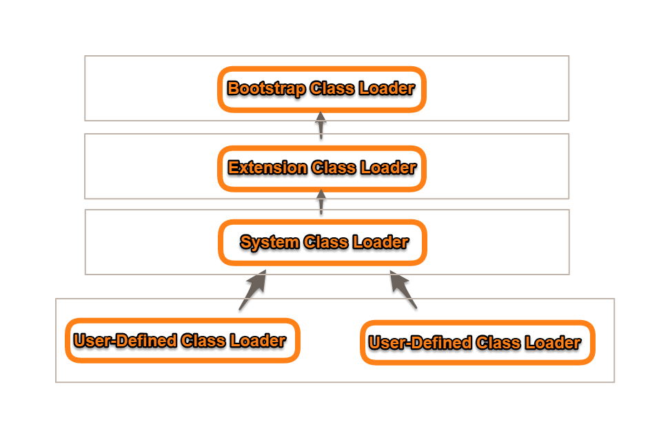
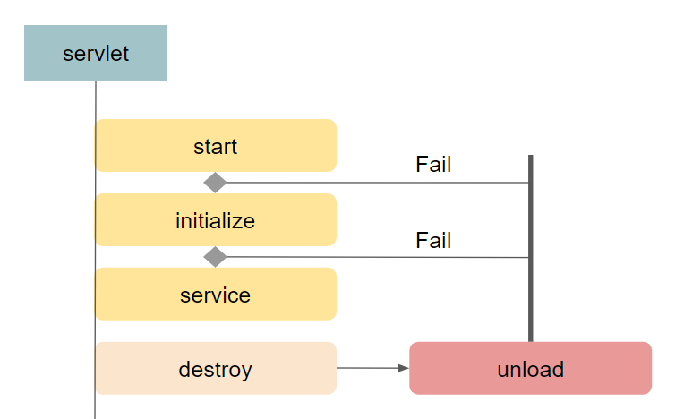

<!--more-->
> '나무위키'를 참조하였습니다.

## Spring Framework

* Java/JSP 기반의 웹 프레임워크
* JVM 위에서 돌아가며 Apache 를 다르는 오픈 소스 프레임워크
* **Spring Boot** 는 스프링 프레임워크 프로젝트를 간편하게 세팅할 수 있도록 도와주는 서브 프로젝트

## Spring의 특징

### POJO (Plain Old Java Object)
* Java EE를 사용하면서 해당 플랫폼에 종속되어 있는 무거운 객체들을 만드는 것에 반발하며 나타난 용어
* 특정 자바 모델이가 기능, 프레임워크 등을 따르지 않은 자바 오브젝트를 지칭하는 말로 사용
* J2EE 프레임워크에 비해 구현을 위해 특정한 인터페이스를 구현하거나 상속 받을 필요가 없어 기존에 존재하는 라이브러리 등을 지원하기에 용이하고 가벼운 객체

### AOP (Aspect Oriented Programming)
* 로깅, 트랜잭션, 보안 등 여러 모듈에서 공통적으로 사용하는 기능을 **분리** 하여 관리
* AspectJ를 내부적으로 사용 가능

### DI (Dependency Injection)
* 프로그래밍에서 구성요소 간의 의존 관계를 소스코드 내부가 아닌 외부의 설정파일로 정의
* 코드의 재사용성
* 모듈간의 결합도 낮춤
* 계층, 서비스 간에 의존성이 존재하는 경우 스프링 프레임워크가 서로 연결시켜줌

### IoC (Inversion of Control)
* 외부 라이브러리 코드가 개발자의 코드를 호출
* 제어권이 프레임워크에 있음
* 자바의 reflection(반영)을 이용해서 객체의 생명주기를 관리
* 주로 환경설정을 담당하는 XML 파일에 의해 설정

### LifeCycle
* 객체의 생성, 소멸을 직접 관리하며 피요한 객체만 사용

## Spring Architecture

### 1. Core
* IoC 와 DI 기능을 제공

### 2. DAO
* JDBC 추상 계층을 제공

### 3. ORM
* JPA, MyBatis, Hibernate와 같은 ORM API들과 통합할 수 있는 기능을 제공

### 4. AOP
* 스프링 프레임워크에서 제공하는 AOP 패키지 제공

### 5. Web
* Spring Web MVC, Struts, WebWork 등 웹 어플리케이션 구현에 도움되는 기능을 제공

## Spring MVC

### MVC
* Model
  * Data를 저장, 처리
* View
  * Model로부터 받은 자료를 여러 가지 형태로 사용자에게 보여주는 역할
* Controller
  * View와 Model 사이에서 관계를 설정

Component | 개요
:---:|:---
DispatcherServlet|Spring MVC Framework의 Front Controller    웹 요청/응답의 생명주기를 관리
HandlerMapping|Request URL을 어떤 Controller에게 넘겨줄지 결정
Controller|비즈니스 로직을 수행하고 Response를 ModelAndView에 반영
ModelAndView|로직 수행 결과 데이터인 Model객체와 이동할 View 정보
ViewResolver|어떤 View를 보여줄지 결정
View|Response Model 객체를 display

1. `Client`가 `Servlet`에 `Request URL`을 보냄
2. **HandlerMapping** : `Request URL`과 매핑되는 `Controller` 검색
3. 매핑된 `Controller에` 처리를 요청
4. 해당하는 `ModelAndView`를 리턴
5. **ViewResolver** : `Controller`의 `Response`를 보여줄 `View`를 검색
6. 해당 `View`에 `Response` 출력
